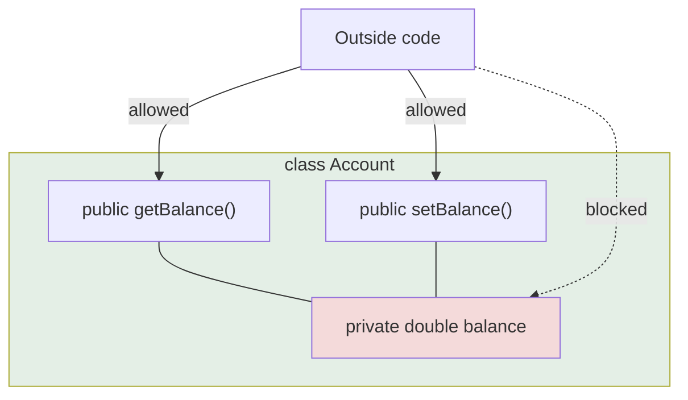

<div align="center">


  

</div>

---

> **In one line:** Binding data and methods together while hiding the data behind private fields and public getters and setters.

## 1. What Is It?

**Encapsulation** means binding data (variables) and the code acting on that data (methods) into a single unit, and **hiding the data** from the outside world.

It is achieved by:

1. Declaring all variables as `private`.
2. Providing `public` **getter** and **setter** methods to read and write them.

## 2. The Capsule Picture



## 3. Syntax

```java
class Account {
    private double balance;

    public double getBalance() { return balance; }
    public void setBalance(double balance) { this.balance = balance; }
}
```

## 4. Advantages

| Benefit | Explanation |
|---|---|
| **Data hiding** | The internal state cannot be touched directly |
| **Control** | A setter can validate before storing a value |
| **Read-only / write-only** | Provide only a getter, or only a setter |
| **Flexibility** | The internal representation can change without breaking callers |
| **Reusability** | Encapsulated classes are easy to move between projects |

## 5. Encapsulation vs Abstraction

| Encapsulation | Abstraction |
|---|---|
| Hides the **data** | Hides the **implementation** |
| Achieved with access modifiers | Achieved with abstract classes and interfaces |
| Answers "how is the data protected?" | Answers "what does it do?" |

## 6. In Depth

Encapsulation is often reduced to "make fields private and add getters and setters", but that alone achieves very little. A class with a public getter and setter for every field exposes its internal structure just as completely as public fields do; it simply does so through more code.

Real encapsulation means the class exposes **operations, not data**. A bank account offers `deposit()` and `withdraw()`, which enforce the rules, rather than `setBalance()`, which allows any value. The benefit is that every invariant of the object is guaranteed by the class itself, in one place, instead of being re-checked by every caller.

Practical techniques that strengthen encapsulation:

- **Validate in setters and constructors**, and throw rather than storing an invalid state.
- **Do not leak mutable internals.** Returning the internal `List` or array lets a caller modify the object's state behind its back; return an unmodifiable view or a defensive copy instead.
- **Prefer immutability** where possible: make fields `private final`, assign them in the constructor, and provide no setters at all. Immutable objects are automatically thread safe and can never enter an invalid state.

Encapsulation is also what makes refactoring safe: as long as the public methods keep their contract, the fields behind them can be renamed, split, computed on demand or moved to another class without any caller noticing.

## 7. Quick Revision

> private variables + public getters/setters = encapsulation (data hiding).

---

<div align="center">

<a href="01-Access-Modifiers.md">← Access Modifiers</a> &nbsp;•&nbsp; <a href="../README.md">Home</a> &nbsp;•&nbsp; <a href="03-Inheritance.md">Inheritance →</a>


<sub>Core Java Theory Notes • Maintained by <b>Kundan</b></sub>

</div>
