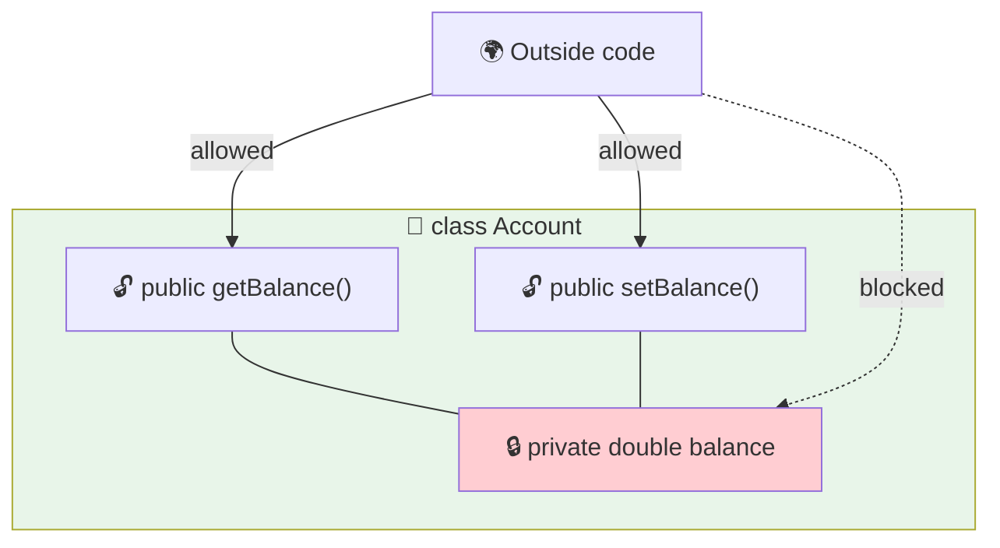

<div align="center">


  

</div>

---

> **In one line:** Binding data and methods together while hiding the data behind private fields and public getters and setters.

## 🧠 1. What Is It?

**Encapsulation** means binding data (variables) and the code acting on that data (methods) into a single unit, and **hiding the data** from the outside world.

It is achieved by:

1. Declaring all variables as `private`.
2. Providing `public` **getter** and **setter** methods to read and write them.

## 🧩 2. The Capsule Picture



## 🧾 3. Syntax

```java
class Account {
    private double balance;

    public double getBalance() { return balance; }
    public void setBalance(double balance) { this.balance = balance; }
}
```

## ✅ 4. Advantages

| Benefit | Explanation |
|---|---|
| **Data hiding** | The internal state cannot be touched directly |
| **Control** | A setter can validate before storing a value |
| **Read-only / write-only** | Provide only a getter, or only a setter |
| **Flexibility** | The internal representation can change without breaking callers |
| **Reusability** | Encapsulated classes are easy to move between projects |

## ⚖️ 5. Encapsulation vs Abstraction

| Encapsulation | Abstraction |
|---|---|
| Hides the **data** | Hides the **implementation** |
| Achieved with access modifiers | Achieved with abstract classes and interfaces |
| Answers "how is the data protected?" | Answers "what does it do?" |

## 🔁 6. Quick Revision

> private variables + public getters/setters = encapsulation (data hiding).

---

<div align="center">

<a href="01-Access-Modifiers.md">⬅️ Access Modifiers</a> &nbsp;•&nbsp; <a href="../README.md">🏠 Home</a> &nbsp;•&nbsp; <a href="03-Inheritance.md">Inheritance ➡️</a>


<sub>📘 Core Java Theory Notes • Maintained by <b>Kundan</b></sub>

</div>
