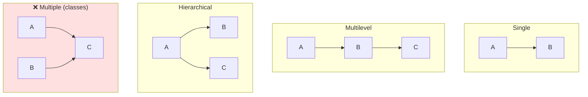

<div align="center">


  

</div>

---

> **In one line:** Taking the properties of one class into another class to reuse code.

## 🧠 1. What Is It?

**Inheritance** means taking the properties of one class into another class. The class that gives its properties is the **parent / super / base** class, and the class that receives them is the **child / sub / derived** class. It is achieved with the `extends` keyword.

## 🧩 2. Types Of Inheritance



| Type | Supported by classes? | Note |
|---|---|---|
| Single | ✅ | One parent, one child |
| Multilevel | ✅ | A chain of classes |
| Hierarchical | ✅ | One parent, many children |
| **Multiple** | ❌ | Not supported for classes — causes the **diamond problem**; use **interfaces** instead |
| Hybrid | ❌ (via classes) | Possible only through interfaces |

## 🧾 3. Syntax

```java
class Parent { }
class Child extends Parent { }
```

## ⚙️ 4. What Is And Is Not Inherited

| Member | Inherited? |
|---|---|
| public and protected members | ✅ Yes |
| default members (same package) | ✅ Yes |
| private members | ❌ No |
| Constructors | ❌ No (but called with `super()`) |

## 🔑 5. The super Keyword

| Usage | Meaning |
|---|---|
| `super.variable` | Parent class variable |
| `super.method()` | Parent class method |
| `super()` | Parent class constructor — must be the first statement |

## 📌 6. Important Rules

- Java supports **only single inheritance** for classes.
- Every class implicitly extends `java.lang.Object`.
- A `final` class cannot be extended.

## ✅ 7. Advantages

- Code **reusability** — write once in the parent, use in every child.
- Enables **method overriding**, and therefore runtime polymorphism.

## 🔁 8. Quick Revision

> `extends` = IS-A relationship. Single, multilevel and hierarchical are allowed; multiple inheritance only via interfaces.

---

<div align="center">

<a href="02-Encapsulation.md">⬅️ Encapsulation</a> &nbsp;•&nbsp; <a href="../README.md">🏠 Home</a> &nbsp;•&nbsp; <a href="04-Polymorphism.md">Polymorphism ➡️</a>


<sub>📘 Core Java Theory Notes • Maintained by <b>Kundan</b></sub>

</div>
