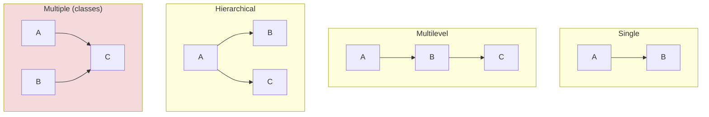

<div align="center">


  

</div>

---

> **In one line:** Taking the properties of one class into another class to reuse code.

## 1. What Is It?

**Inheritance** means taking the properties of one class into another class. The class that gives its properties is the **parent / super / base** class, and the class that receives them is the **child / sub / derived** class. It is achieved with the `extends` keyword.

## 2. Types Of Inheritance



| Type | Supported by classes? | Note |
|---|---|---|
| Single | Yes | One parent, one child |
| Multilevel | Yes | A chain of classes |
| Hierarchical | Yes | One parent, many children |
| **Multiple** | No | Not supported for classes — causes the **diamond problem**; use **interfaces** instead |
| Hybrid | (via classes) | Possible only through interfaces |

## 3. Syntax

```java
class Parent { }
class Child extends Parent { }
```

## 4. What Is And Is Not Inherited

| Member | Inherited? |
|---|---|
| public and protected members | Yes |
| default members (same package) | Yes |
| private members | No |
| Constructors | No (but called with `super()`) |

## 5. The super Keyword

| Usage | Meaning |
|---|---|
| `super.variable` | Parent class variable |
| `super.method()` | Parent class method |
| `super()` | Parent class constructor — must be the first statement |

## 6. Important Rules

- Java supports **only single inheritance** for classes.
- Every class implicitly extends `java.lang.Object`.
- A `final` class cannot be extended.

## 7. Advantages

- Code **reusability** — write once in the parent, use in every child.
- Enables **method overriding**, and therefore runtime polymorphism.

## 8. In Depth

Inheritance creates the strongest coupling available in Java: a subclass depends on its parent's implementation, not merely on its interface. A change inside the parent can silently break every subclass, a problem known as the fragile base class.

This is why the widely followed guidance is to **favour composition over inheritance**, and to use inheritance only where a genuine IS-A relationship holds and the parent was explicitly designed to be extended — documented, with the extension points clear, or otherwise declared `final`.

**Substitutability** is the test for a correct hierarchy. Anywhere a parent reference is used, any subclass object must work without surprising the caller. A subclass that throws where the parent succeeds, or that tightens what the parent accepted, breaks that contract even if it compiles.

**Constructors are not inherited**, but they are chained: every subclass constructor invokes a parent constructor first, so the object is built from `Object` downwards. Fields are **not** polymorphic — a field accessed through a parent reference resolves to the parent's field, while a method call resolves to the subclass override. Mixing those two behaviours is a frequent source of confusion.

Java forbids multiple class inheritance because two parents could supply conflicting implementations and state — the diamond problem. Interfaces avoid the state half of that problem, and where two interfaces supply conflicting `default` methods the compiler forces the class to resolve the conflict explicitly.

## 9. Quick Revision

> `extends` = IS-A relationship. Single, multilevel and hierarchical are allowed; multiple inheritance only via interfaces.

---

<div align="center">

<a href="02-Encapsulation.md">← Encapsulation</a> &nbsp;•&nbsp; <a href="../README.md">Home</a> &nbsp;•&nbsp; <a href="04-Polymorphism.md">Polymorphism →</a>


<sub>Core Java Theory Notes • Maintained by <b>Kundan</b></sub>

</div>
