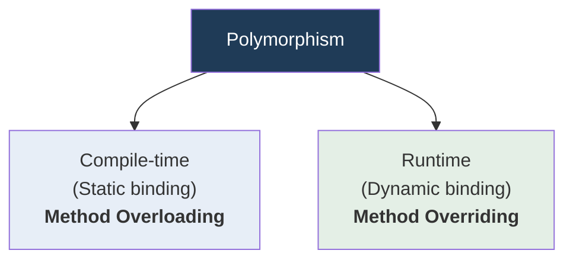
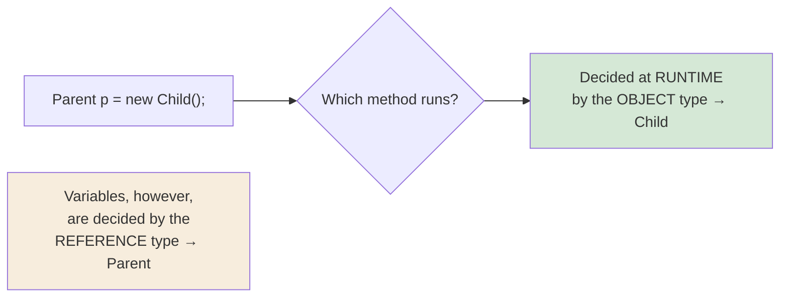

<div align="center">


  

</div>

---

> **In one line:** One name, many forms — achieved by overloading at compile time and overriding at runtime.

## 1. What Is It?

**Polymorphism** means "many forms" — the same method name behaving differently depending on the context.

## 2. Two Types



## 3. Overloading vs Overriding

| Feature | Overloading | Overriding |
|---|---|---|
| Where | Same class | Parent and child class |
| Parameters | Must differ | Must be identical |
| Return type | Can differ | Same or covariant |
| Binding | Compile time (static) | Runtime (dynamic) |
| Access modifier | Anything | Cannot be more restrictive than the parent |
| `static` / `private` / `final` methods | Can be overloaded | Cannot be overridden |

## 4. Dynamic Method Dispatch



A parent reference can point to a child object. The **method** that runs comes from the object, while a **variable** accessed comes from the reference type.

## 5. Syntax

```java
class Parent { void show() { } }
class Child extends Parent {
    @Override
    void show() { }        // overriding
}
```

## 6. Rules For Overriding

- The method signature must match exactly.
- The access level cannot be reduced.
- The child cannot throw broader **checked** exceptions.
- `static`, `final` and `private` methods cannot be overridden.

## 7. Common Mistakes

- Calling a redefined `static` method "overriding" — it is **method hiding**.
- Changing only the return type and expecting overloading.

## 8. In Depth

Overloading and overriding are resolved at different times by different information, and that is the whole distinction.

**Overloading is static.** The compiler chooses among the candidates using the *declared* types of the arguments. Nothing about the runtime object matters, which is why a method overloaded on `Parent` and `Child` will pick the `Parent` version when the argument is declared as `Parent`, even if it holds a `Child` at runtime.

**Overriding is dynamic.** The compiler only verifies that a suitable method exists on the declared type; the JVM then uses the object's actual class to select the implementation, through a per-class virtual method table. This indirection is what lets a framework call code written years later.

Consequences worth remembering:

- `static` methods are not overridden but **hidden**; the one that runs is chosen by the reference type.
- `private` and `final` methods are bound statically, which is also why the JIT can inline them aggressively.
- Fields are never polymorphic.
- An overriding method may return a **covariant** type (a subtype of the parent's return type), may widen access, and may throw fewer or narrower checked exceptions — never more.
- `@Override` is optional but valuable: it turns a silent accidental overload into a compile error.

## 9. Quick Revision

> Overloading = same class, different parameters, compile time. Overriding = parent/child, same signature, runtime.

---

<div align="center">

<a href="03-Inheritance.md">← Inheritance</a> &nbsp;•&nbsp; <a href="../README.md">Home</a> &nbsp;•&nbsp; <a href="05-Abstraction.md">Abstraction →</a>


<sub>Core Java Theory Notes • Maintained by <b>Kundan</b></sub>

</div>
