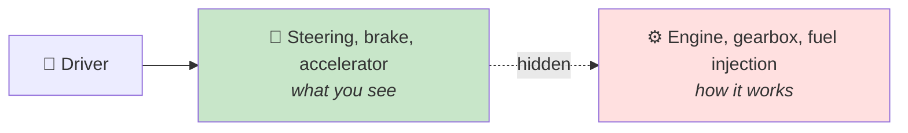

<div align="center">


  

</div>

---

> **In one line:** Showing only what a component does while hiding how it does it.

## 🧠 1. What Is It?

**Abstraction** is the process of showing only the **essential features** and hiding the **implementation details**. The user knows *what* a method does, not *how* it does it.

## 🧩 2. Everyday Picture



## 🛠️ 3. How Java Achieves It

| Way | Abstraction level |
|---|---|
| **Abstract class** | Partial (0% to 100%) |
| **Interface** | Full (100% by design) |

## 🧾 4. Syntax

```java
abstract class Shape {
    abstract void draw();       // what, not how
}
```

## ✅ 5. Advantages

- Reduces complexity for the caller.
- The implementation can change freely without breaking callers.
- Enforces a **contract** that every implementing class must follow.
- Increases security by exposing only what is needed.

## ⚖️ 6. Abstraction vs Encapsulation

| Abstraction | Encapsulation |
|---|---|
| Hides implementation | Hides data |
| Design level concern | Implementation level concern |
| Abstract classes and interfaces | Access modifiers, getters and setters |

## 🔁 7. Quick Revision

> Abstraction = show **what**, hide **how**. Abstract class = partial, interface = full.

---

<div align="center">

<a href="04-Polymorphism.md">⬅️ Polymorphism</a> &nbsp;•&nbsp; <a href="../README.md">🏠 Home</a> &nbsp;•&nbsp; <a href="06-Interfaces.md">Interfaces ➡️</a>


<sub>📘 Core Java Theory Notes • Maintained by <b>Kundan</b></sub>

</div>
