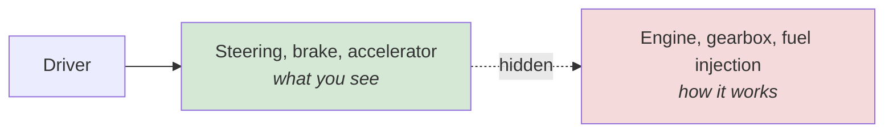

<div align="center">


  

</div>

---

> **In one line:** Showing only what a component does while hiding how it does it.

## 1. What Is It?

**Abstraction** is the process of showing only the **essential features** and hiding the **implementation details**. The user knows *what* a method does, not *how* it does it.

## 2. Everyday Picture



## 3. How Java Achieves It

| Way | Abstraction level |
|---|---|
| **Abstract class** | Partial (0% to 100%) |
| **Interface** | Full (100% by design) |

## 4. Syntax

```java
abstract class Shape {
    abstract void draw();       // what, not how
}
```

## 5. Advantages

- Reduces complexity for the caller.
- The implementation can change freely without breaking callers.
- Enforces a **contract** that every implementing class must follow.
- Increases security by exposing only what is needed.

## 6. Abstraction vs Encapsulation

| Abstraction | Encapsulation |
|---|---|
| Hides implementation | Hides data |
| Design level concern | Implementation level concern |
| Abstract classes and interfaces | Access modifiers, getters and setters |

## 7. In Depth

Abstraction is the design counterpart to encapsulation. Encapsulation hides data inside one class; abstraction hides an entire implementation behind a type, so that code can be written against the type and remain valid when the implementation changes.

Its practical payoff is **dependency inversion**: high-level code depends on an abstraction, and concrete implementations depend on the same abstraction rather than on each other. A service written against a `PaymentProcessor` interface works unchanged with a card processor, a wallet processor or a test double. This is the mechanism behind dependency injection frameworks and behind almost all unit testing with mocks.

Choosing the right abstraction is a judgement call rather than a rule. Useful questions: what will realistically vary, what must stay stable, and what is the smallest contract that expresses the responsibility? Over-abstracting is a real cost — an interface with one implementation that will never have another adds indirection without benefit.

A well-designed abstraction also hides **how many** classes are involved. The caller sees one type, while behind it a factory may choose among several implementations, apply caching or add logging, none of which the caller needs to know.

## 8. Quick Revision

> Abstraction = show **what**, hide **how**. Abstract class = partial, interface = full.

---

<div align="center">

<a href="04-Polymorphism.md">← Polymorphism</a> &nbsp;•&nbsp; <a href="../README.md">Home</a> &nbsp;•&nbsp; <a href="06-Interfaces.md">Interfaces →</a>


<sub>Core Java Theory Notes • Maintained by <b>Kundan</b></sub>

</div>
