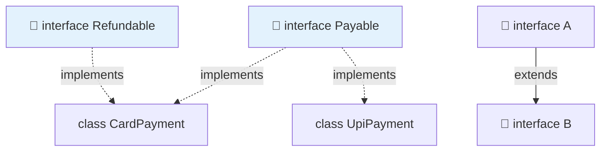

<div align="center">


  

</div>

---

> **In one line:** An interface is a pure contract of method declarations that implementing classes must fulfil.

## 🧠 1. What Is It?

An **interface** is a blueprint of a class that contains only **abstract methods** (before Java 8) and **constants**. It defines *what* must be done, never *how*.

## 🧩 2. Interface Relationships



A class **implements** an interface; an interface **extends** another interface. A class can implement **many** interfaces, which is how Java supports multiple inheritance.

## 🧾 3. Syntax

```java
interface Payable {
    double TAX = 0.18;      // public static final
    void pay();             // public abstract
}

class Card implements Payable {
    public void pay() { }
}
```

## 📋 4. Default Nature Of Members

| Member | Implicit modifiers |
|---|---|
| Variables | `public static final` — constants only |
| Methods (before Java 8) | `public abstract` |
| Java 8 `default` methods | Have a body, can be overridden |
| Java 8 `static` methods | Belong to the interface itself |
| Java 9 `private` methods | Helper code shared inside the interface |

## 📌 5. Important Rules

- An interface cannot be instantiated.
- It has **no constructor**.
- All variables are constants and must be initialized.
- Implementing methods must be declared `public`.

## 🔁 6. Quick Revision

> Interface = pure contract, `implements`, constants + abstract methods, and the Java answer to multiple inheritance.

---

<div align="center">

<a href="05-Abstraction.md">⬅️ Abstraction</a> &nbsp;•&nbsp; <a href="../README.md">🏠 Home</a> &nbsp;•&nbsp; <a href="07-Abstract-Classes.md">Abstract Classes ➡️</a>


<sub>📘 Core Java Theory Notes • Maintained by <b>Kundan</b></sub>

</div>
