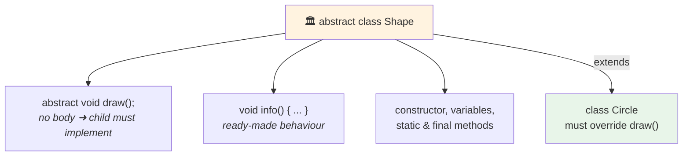

<div align="center">


  

</div>

---

> **In one line:** A partially completed class that mixes abstract methods with ready-made behaviour.

## 🧠 1. What Is It?

An **abstract class** is declared with the `abstract` keyword. It may contain **abstract methods** (declared without a body) as well as **concrete methods** (with a body). It **cannot be instantiated** — it exists to be extended.

## 🧩 2. Structure



## 🧾 3. Syntax

```java
abstract class Shape {
    abstract void draw();
    void info() { }
}
```

## 📌 4. Important Rules

- If a class has even one abstract method, the class **must** be declared abstract.
- An abstract class can exist **without** any abstract method.
- A child class must override every abstract method, or be declared abstract itself.
- Abstract classes **can** have constructors, instance variables and static methods.
- `abstract` cannot be combined with `final`, `static` or `private`.

## ⚖️ 5. Abstract Class vs Interface

| Feature | Abstract class | Interface |
|---|---|---|
| Abstraction | 0% to 100% (partial) | 100% (by design) |
| Methods | Abstract + concrete | Abstract, plus default/static from Java 8 |
| Variables | Any kind | `public static final` only |
| Constructor | ✅ Yes | ❌ No |
| Inheritance | `extends` — only one | `implements` — many |
| Access modifiers | Any | Members are implicitly public |
| Use when | Classes share common state and code | Unrelated classes share a capability |

## 🔁 6. Quick Revision

> Abstract class = partial abstraction + shared code + single inheritance. Interface = full contract + multiple inheritance.

---

<div align="center">

<a href="06-Interfaces.md">⬅️ Interfaces</a> &nbsp;•&nbsp; <a href="../README.md">🏠 Home</a> &nbsp;•&nbsp; <a href="08-Object-Class.md">Object Class ➡️</a>


<sub>📘 Core Java Theory Notes • Maintained by <b>Kundan</b></sub>

</div>
