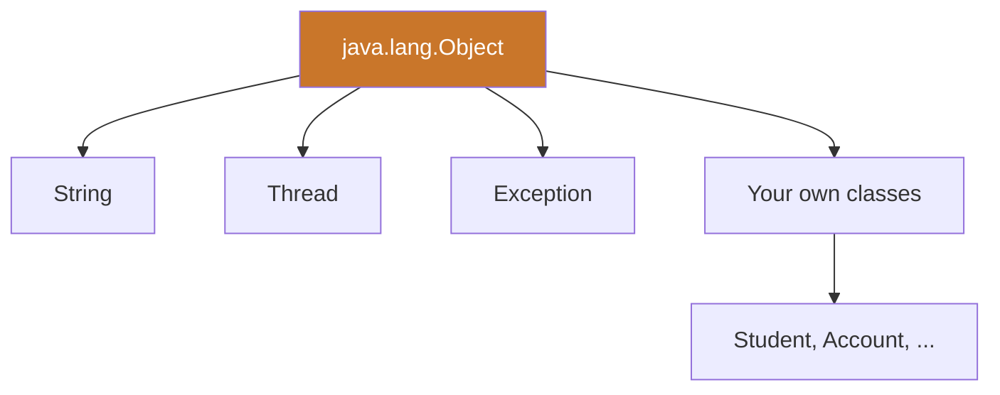
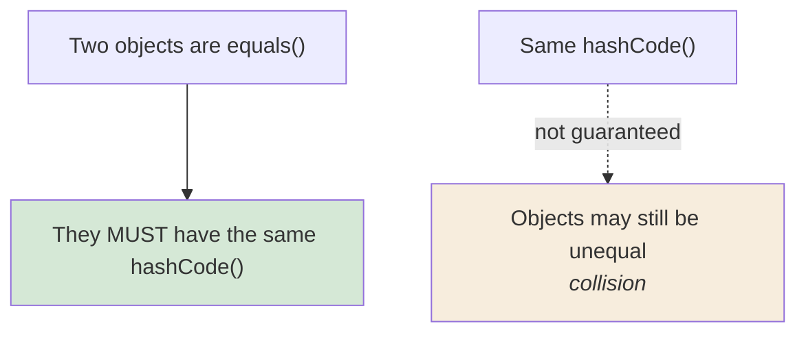

  

---

> **In one line:** java.lang.Object is the root parent of every class in Java.

## 1. What Is It?

`java.lang.Object` is the **root class** of the Java class hierarchy. Every class extends it directly or indirectly, which means every object inherits its methods.

## 2. Hierarchy

## 3. Methods Of Object

| Method | Purpose |
|---|---|
| `toString()` | Text representation of the object |
| `equals(Object)` | Content comparison (reference comparison by default) |
| `hashCode()` | Integer hash used by hash-based collections |
| `getClass()` | Runtime class information |
| `clone()` | Creates a copy of the object |
| `finalize()` | Called before garbage collection (deprecated) |
| `wait()`, `notify()`, `notifyAll()` | Inter-thread communication |

## 4. equals() and hashCode() Contract

Whenever `equals()` is overridden, `hashCode()` must be overridden too, otherwise `HashSet` and `HashMap` behave incorrectly.

## 5. Important Rules

- The default `toString()` prints `className@hexHashCode`.
- The default `equals()` compares **references**, exactly like `==`.
- `String` and the wrapper classes already override `equals()`, `hashCode()` and `toString()`.

## 6. In Depth

`Object` is what makes a single, universal type system possible: every reference can be assigned to `Object`, which is why collections, reflection and serialisation can work with any type at all.

**`equals()` has a contract**, and hash-based collections rely on it. It must be reflexive, symmetric, transitive, consistent, and never equal to `null`. A frequent mistake is writing `equals(MyType other)`, which overloads rather than overrides, so the collection keeps calling the inherited reference comparison and the object appears to vanish from a `HashSet`.

**`hashCode()` must agree with `equals()`.** Equal objects must produce equal hash codes; unequal objects may collide, and a collision only costs performance. Mutating a field used in `hashCode()` after inserting the object into a `HashMap` effectively loses the entry, which is why immutable keys are strongly preferred.

**`toString()`** exists to make debugging and logging useful; the default `ClassName@1b6d3586` tells you almost nothing.

**`clone()` is best avoided.** It requires implementing `Cloneable`, performs a shallow copy by default, and bypasses constructors. A copy constructor or a static factory method is clearer and safer. `finalize()` is deprecated for similar reasons: it was unreliable and could resurrect objects; `try-with-resources` and cleaners replace it.

The remaining methods — `wait()`, `notify()`, `notifyAll()` and `getClass()` — are on `Object` because locking and type metadata apply to every object in the JVM.

## 7. Quick Revision

> Every class inherits from `Object`. Override `toString()`, and override `equals()` and `hashCode()` together.

---

<a href="07-Abstract-Classes.md">← Abstract Classes</a> &nbsp;•&nbsp; <a href="../README.md">Home</a> &nbsp;•&nbsp; <a href="../07-Packages-Wrapper-Exceptions/README.md">Packages, Wrappers & Exceptions →</a>

Core Java Theory Notes • Maintained by <b>Kundan</b>

