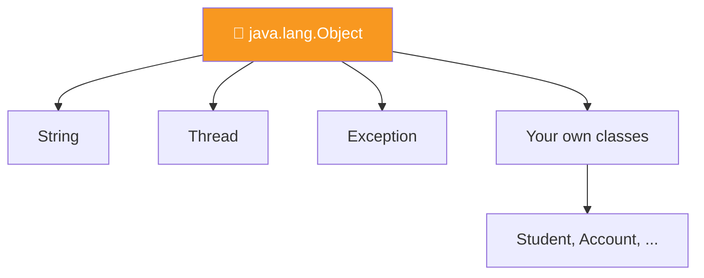
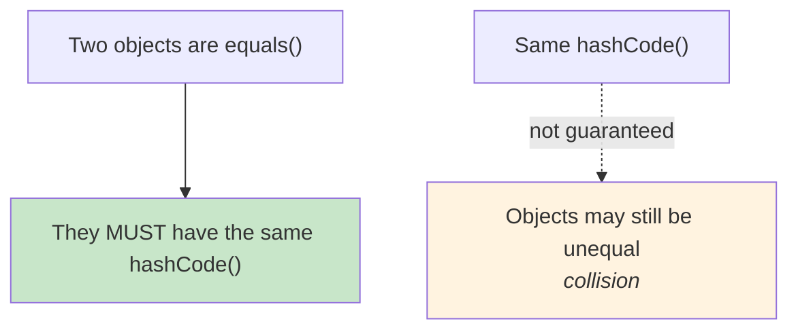

  

---

> **In one line:** java.lang.Object is the root parent of every class in Java.

## 🧠 1. What Is It?

`java.lang.Object` is the **root class** of the Java class hierarchy. Every class extends it directly or indirectly, which means every object inherits its methods.

## 🧩 2. Hierarchy

## 📋 3. Methods Of Object

| Method | Purpose |
|---|---|
| `toString()` | Text representation of the object |
| `equals(Object)` | Content comparison (reference comparison by default) |
| `hashCode()` | Integer hash used by hash-based collections |
| `getClass()` | Runtime class information |
| `clone()` | Creates a copy of the object |
| `finalize()` | Called before garbage collection (deprecated) |
| `wait()`, `notify()`, `notifyAll()` | Inter-thread communication |

## ⚖️ 4. equals() and hashCode() Contract

Whenever `equals()` is overridden, `hashCode()` must be overridden too, otherwise `HashSet` and `HashMap` behave incorrectly.

## 📌 5. Important Rules

- The default `toString()` prints `className@hexHashCode`.
- The default `equals()` compares **references**, exactly like `==`.
- `String` and the wrapper classes already override `equals()`, `hashCode()` and `toString()`.

## 🔁 6. Quick Revision

> Every class inherits from `Object`. Override `toString()`, and override `equals()` and `hashCode()` together.

---

<a href="07-Abstract-Classes.md">⬅️ Abstract Classes</a> &nbsp;•&nbsp; <a href="../README.md">🏠 Home</a> &nbsp;•&nbsp; <a href="../07-Packages-Wrapper-Exceptions/README.md">Packages, Wrappers & Exceptions ➡️</a>

📘 Core Java Theory Notes • Maintained by <b>Kundan</b>

