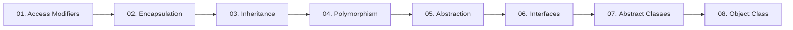

  

---

> The four pillars in depth — access control, encapsulation, inheritance, polymorphism and abstraction — plus interfaces, abstract classes and the Object class.

## 📚 Topics In This Chapter

| # | Topic | What you will learn |
|---|---|---|
| 01 | [Access Modifiers](./01-Access-Modifiers.md) | Controlling visibility with private, default, protected and public |
| 02 | [Encapsulation](./02-Encapsulation.md) | Wrapping data and behaviour into one protected unit |
| 03 | [Inheritance](./03-Inheritance.md) | Reusing code through parent and child class relationships |
| 04 | [Polymorphism](./04-Polymorphism.md) | Compile-time and runtime polymorphism explained |
| 05 | [Abstraction](./05-Abstraction.md) | Hiding implementation details behind a simple contract |
| 06 | [Interfaces](./06-Interfaces.md) | Contracts, multiple inheritance and interface members |
| 07 | [Abstract Classes](./07-Abstract-Classes.md) | Partial abstraction and when to prefer it over an interface |
| 08 | [Object Class](./08-Object-Class.md) | The universal parent class and its eleven methods |

## 🗺️ Learning Path

---

<a href="../05-OOPS-Part-1/README.md">⬅️ Constructor</a> &nbsp;•&nbsp; <a href="../README.md">🏠 Home</a> &nbsp;•&nbsp; <a href="../07-Packages-Wrapper-Exceptions/README.md">Packages, Wrappers & Exceptions ➡️</a>

📘 Core Java Theory Notes • Maintained by <b>Kundan</b>

