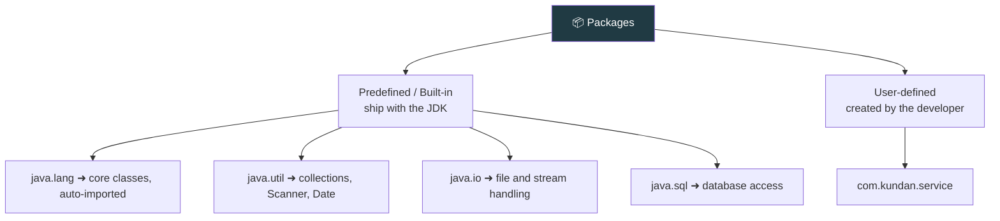

<div align="center">


  

</div>

---

> **In one line:** A package is a group of related classes, interfaces and sub-packages organised by functionality.

## 🧠 1. What Is It?

In small projects all Java files have unique names, so a single folder is fine. In huge projects with many files, storing everything in one folder becomes disorganised, and two files with the same name cannot live in the same folder — this causes a **naming conflict**.

A **package** solves this: it is a group of related classes, interfaces and sub-packages grouped by their functionality.

## 🧩 2. Types Of Packages



## 🧾 3. Syntax

```java
package com.kundan.service;   // declaring
import java.util.Scanner;     // using another package
import java.util.*;           // importing everything
```

## 📌 4. Important Rules

- At most **one** `package` statement per file, and it must be the **first** statement.
- `import` statements come after `package` and before the class.
- `java.lang` is imported automatically.
- The folder structure on disk must match the package name.
- A fully qualified name such as `java.util.List` can be used instead of an import.

## ✅ 5. Advantages

| Benefit | Explanation |
|---|---|
| **No naming conflicts** | Two classes with the same name can live in different packages |
| **Organisation** | Related classes stay together |
| **Access control** | The `default` and `protected` levels are package-based |
| **Reusability** | A package can be shared across projects |

## ⚠️ 6. Common Mistakes

- Writing `import` above `package`.
- Using uppercase letters in package names.
- Assuming `import java.util.*;` also imports sub-packages — it does not.

## 🔁 7. Quick Revision

> Package = folder of related types. One `package` statement, many `import` statements, `java.lang` is free.

---

<div align="center">

<a href="../06-OOPS-Part-2/08-Object-Class.md">⬅️ Object Class</a> &nbsp;•&nbsp; <a href="../README.md">🏠 Home</a> &nbsp;•&nbsp; <a href="02-Wrapper-Classes.md">Wrapper Classes ➡️</a>


<sub>📘 Core Java Theory Notes • Maintained by <b>Kundan</b></sub>

</div>
