  

---

> **In one line:** Wrapper classes convert the eight primitive types into objects so they can be used where objects are required.

## 1. What Is It?

A **wrapper class** wraps a primitive value inside an object. Collections, generics and many APIs work only with objects, not primitives — wrappers bridge that gap.

## 2. The Eight Wrappers

```mermaid
flowchart LR
    subgraph PR["Primitive"]
        p1["byte"]:::p
        p2["short"]:::p
        p3["int"]:::p
        p4["long"]:::p
        p5["float"]:::p
        p6["double"]:::p
        p7["char"]:::p
        p8["boolean"]:::p
    end
    subgraph WR["Wrapper class"]
        w1["Byte"]
        w2["Short"]
        w3["Integer"]
        w4["Long"]
        w5["Float"]
        w6["Double"]
        w7["Character"]
        w8["Boolean"]
    end
    PR -->|autoboxing| WR
    WR -->|unboxing| PR
    style PR fill:#e4efe6
    style WR fill:#e7eef7
```

| Primitive | Wrapper |
|---|---|
| `byte` | `Byte` |
| `short` | `Short` |
| `int` | **`Integer`** |
| `long` | `Long` |
| `float` | `Float` |
| `double` | `Double` |
| `char` | **`Character`** |
| `boolean` | `Boolean` |

## 3. Autoboxing And Unboxing

| Term | Direction | Example |
|---|---|---|
| **Autoboxing** | primitive → object | `Integer i = 10;` |
| **Unboxing** | object → primitive | `int x = i;` | Both were introduced in **Java 5** and are performed automatically by the compiler.

## 4. Useful Methods

| Method | Purpose |
|---|---|
| `Integer.parseInt("25")` | String → primitive int |
| `Integer.valueOf("25")` | String → Integer object |
| `String.valueOf(25)` | Number → String |
| `intValue()`, `doubleValue()` | Object → primitive |
| `Integer.MAX_VALUE` | Type limits as constants |

## 5. Important Rules

- All wrapper classes are **immutable** and **final**.
- They live in `java.lang`, so no import is needed.
- Parsing invalid text throws `NumberFormatException`.
- Wrapper objects must be compared with `.equals()`, not `==`.

## 6. In Depth

Wrappers exist because Java's type system has two worlds: primitives, which are fast and not objects, and references, which are objects and can be stored in collections and generics. Wrappers are the bridge, and understanding two behaviours prevents most bugs.

**The integer cache.** `valueOf()` caches instances for values between −128 and 127, and autoboxing calls `valueOf()`. So two boxed `Integer` values of 100 are the same object and `==` appears to work, while two boxed values of 1000 are different objects and `==` fails. This is the single most common wrapper bug, and the fix is always `.equals()`.

**Unboxing can throw.** Assigning a `null Integer` to an `int` calls `intValue()` on null and raises `NullPointerException` — a crash with no visible method call in the source. It appears often when a `Map.get()` misses and the result is unboxed immediately.

**Performance.** Autoboxing inside a loop allocates an object per iteration, which is why the Stream API provides `IntStream`, `LongStream` and `DoubleStream`, and why `Arrays.sort(int[])` is dramatically faster than sorting an `Integer[]`.

Wrappers also carry useful static members: `MIN_VALUE` and `MAX_VALUE`, `parseInt()` and `valueOf()`, `compare()`, and conversion helpers such as `Integer.toBinaryString()`.

## 7. Quick Revision

> 8 primitives → 8 wrappers. Autoboxing in, unboxing out. Collections store objects, never primitives.

---

<a href="01-Packages.md">← Packages</a> &nbsp;•&nbsp; <a href="../README.md">Home</a> &nbsp;•&nbsp; <a href="03-Exception-Handling.md">Exception Handling →</a>

Core Java Theory Notes • Maintained by <b>Kundan</b>

