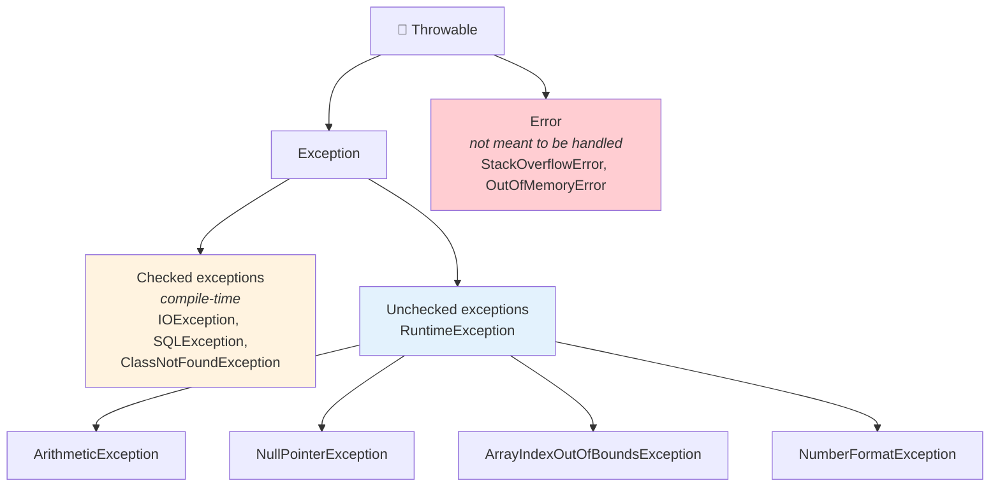
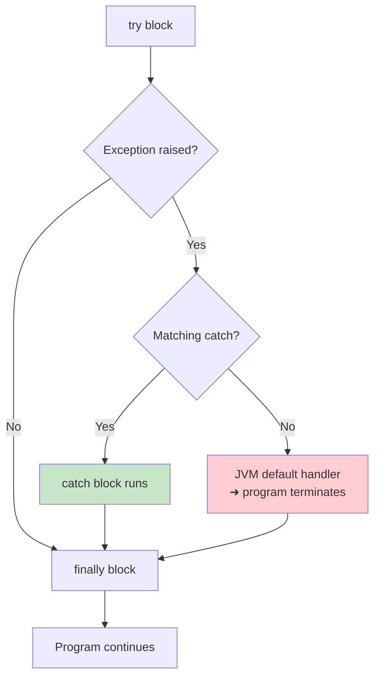

<div align="center">


  

</div>

---

> **In one line:** Exceptions are runtime problems that can be caught and handled so the program keeps running.

## 🧠 1. What Is It?

An **exception** is an abnormal condition that disturbs the normal flow of a program at runtime. Exception handling lets the program deal with the problem and continue instead of terminating abruptly.

## 🧩 2. Exception Hierarchy



## 📋 3. Checked vs Unchecked

| | Checked | Unchecked |
|---|---|---|
| Detected at | Compile time | Runtime |
| Must be handled | ✅ Yes — `try-catch` or `throws` | ❌ Optional |
| Parent | `Exception` | `RuntimeException` |
| Caused by | External factors (file, network, DB) | Programming mistakes |

## 🧾 4. The Five Keywords

| Keyword | Purpose |
|---|---|
| `try` | Wraps the risky code |
| `catch` | Handles a specific exception type |
| `finally` | Always runs — used for cleanup |
| `throw` | Throws one exception object manually |
| `throws` | Declares that a method may throw an exception |

```java
try {
    // risky code
} catch (ArithmeticException e) {
    // handle it
} finally {
    // always executed
}
```

## ⚙️ 5. Execution Flow



## 📌 6. Important Rules

- One `try` can have multiple `catch` blocks, ordered **child class first, parent last**.
- `finally` executes whether or not an exception occurs.
- `throw` takes an **object**; `throws` takes **class names**.
- An overriding method cannot throw broader checked exceptions than the parent.

## 🏗️ 7. Custom Exceptions

Extend `Exception` for a checked custom exception, or `RuntimeException` for an unchecked one.

```java
class InvalidAgeException extends RuntimeException {
    InvalidAgeException(String msg) { super(msg); }
}
```

## ⚠️ 8. Common Mistakes

- Catching a parent exception before its child, which is a compile error.
- Swallowing exceptions with an empty `catch` block.
- Using exceptions for normal flow control.

## ✅ 9. Best Practices

- Catch the most specific exception possible.
- Use `finally` or try-with-resources to close files and connections.
- Always log or communicate the failure rather than hiding it.

## 🔁 10. Quick Revision

> `try` risky ➜ `catch` handle ➜ `finally` cleanup. Checked = compiler forces you; unchecked = your own bug.

---

<div align="center">

<a href="02-Wrapper-Classes.md">⬅️ Wrapper Classes</a> &nbsp;•&nbsp; <a href="../README.md">🏠 Home</a> &nbsp;•&nbsp; <a href="../08-Collections-Framework/README.md">Collections Framework ➡️</a>


<sub>📘 Core Java Theory Notes • Maintained by <b>Kundan</b></sub>

</div>
