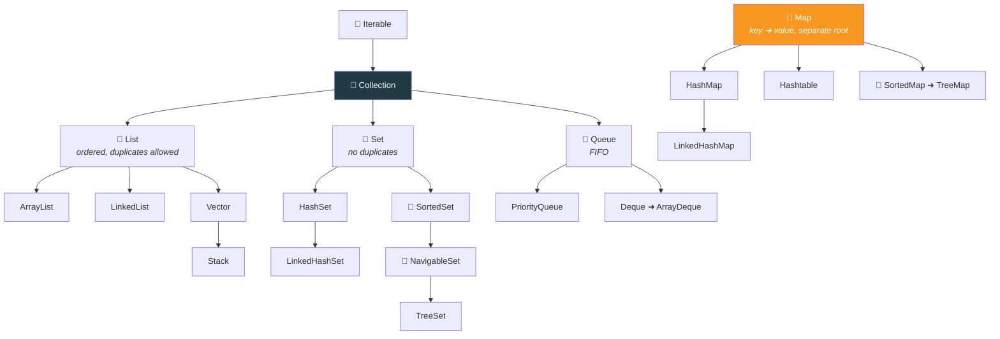

  

---

> **In one line:** Collections are growable containers with ready-made methods, built to replace fixed-size arrays.

## 🧠 1. What Is It?

An array represents a group of elements of the **same** data type, and its main advantage is representing many elements with a single variable. But arrays have hard limits:

1. **Fixed in size** — once created, the size cannot grow or shrink, so the size must be known in advance.
2. **Homogeneous only** — a `Car[]` cannot hold a `Bus`; using `Object[]` fixes this but loses type safety.
3. **No ready-made methods** — arrays are not built on a data structure, so every operation must be coded by hand.

**Collections** solve all three: they are **growable in nature**, can hold heterogeneous objects, and are built on standard data structures with ready-made method support.

## ⚖️ 2. Array vs Collection

| | Array | Collection |
|---|---|---|
| Size | Fixed | Growable |
| Data | Homogeneous only | Homogeneous or heterogeneous |
| Memory | Better (stores primitives) | Slightly more (objects only) |
| Performance | Faster | Slightly slower |
| Method support | None | Rich, ready-made |

## 🧩 3. Collections Hierarchy

> 📎 **Map is not a Collection.** It stores key–value pairs and sits in a separate branch of the framework.

## 📋 4. Core Interfaces

| Interface | Duplicates | Order | Null |
|---|---|---|---|
| **List** | ✅ Allowed | Insertion order kept, index based | Many nulls |
| **Set** | ❌ Not allowed | Usually unordered | One null (most implementations) |
| **Queue** | ✅ Allowed | First-In-First-Out | Depends on implementation |
| **Map** | Keys ❌, values ✅ | Depends on implementation | One null key (HashMap) |

## 🔁 5. Quick Revision

> Collections = growable + heterogeneous + ready-made methods. `Collection` is the root of List/Set/Queue; `Map` stands apart.

---

<a href="../07-Packages-Wrapper-Exceptions/03-Exception-Handling.md">⬅️ Exception Handling</a> &nbsp;•&nbsp; <a href="../README.md">🏠 Home</a> &nbsp;•&nbsp; <a href="02-List-Interface.md">List Interface ➡️</a>

📘 Core Java Theory Notes • Maintained by <b>Kundan</b>

