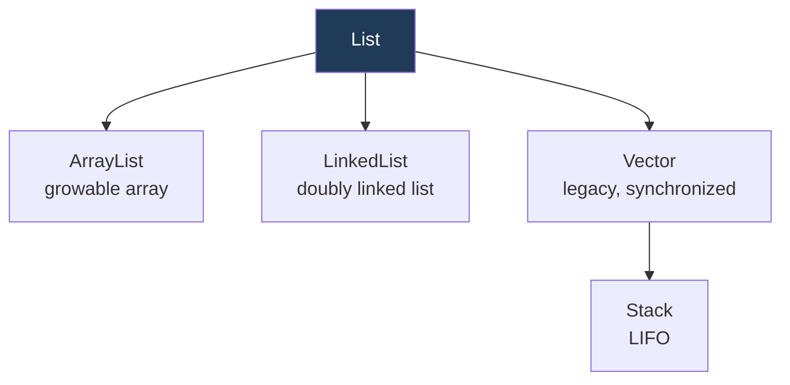
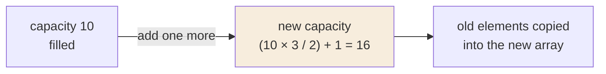
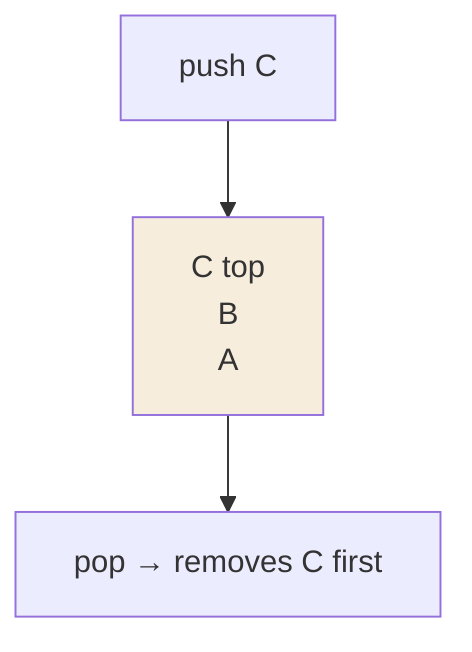

  

---

> **In one line:** An ordered, index-based collection that allows duplicates — ArrayList, LinkedList, Vector and Stack.

## 1. What Is It?

A **List** is a child interface of `Collection` that keeps **insertion order**, allows **duplicates**, and gives **index based** access.

## 2. Implementations

## 3. Comparison

| | ArrayList | LinkedList | Vector | Stack |
|---|---|---|---|---|
| Data structure | Growable array | Doubly linked list | Growable array | Vector subclass |
| Best for | Frequent **retrieval** | Frequent **insert/delete** | Legacy thread-safe code | LIFO processing |
| Synchronized | No | No | Yes | Yes |
| Default capacity | 10 | — | 10 | 10 |
| Growth rule | (current × 3 / 2) + 1 | — | current × 2 | current × 2 |
| Introduced | 1.2 | 1.2 | 1.0 (legacy) | 1.0 (legacy) |

## 4. How ArrayList Grows

## 5. Stack — LIFO

Stack follows the **Last-In-First-Out** principle, with `push()`, `pop()`, `peek()`, `empty()` and `search()`.

## 6. Important Rules

- A `List` preserves **insertion order** and permits duplicates and multiple nulls.
- Use `ArrayList` when reading dominates, `LinkedList` when inserting and removing dominates.
- `Vector` and `Stack` are legacy classes kept for backward compatibility.

## 7. In Depth

`ArrayList` and `LinkedList` differ in their data structure, and every performance difference follows from that.

`ArrayList` stores elements in a contiguous array. Indexed access is a single address calculation, and because the elements sit together in memory they benefit strongly from CPU caching. The costs are growth, which copies the whole array, and insertion or removal in the middle, which shifts every following element.

`LinkedList` stores each element in a node holding two references. Inserting or removing is a matter of relinking, but reaching position *n* means walking *n* nodes, and each node is a separate heap object with its own memory overhead. In practice `ArrayList` outperforms `LinkedList` for most real workloads, and `LinkedList` earns its place mainly as a `Deque` — a queue with efficient work at both ends.

`Vector` and `Stack` are legacy classes retained for compatibility. Their methods are synchronised individually, which is both slower and insufficient for compound operations. Modern equivalents are `ArrayDeque` for stack behaviour and `CopyOnWriteArrayList` or `Collections.synchronizedList()` when thread safety is genuinely required.

Two practical details: `remove(int)` removes by index while `remove(Object)` removes by value, a real trap with a `List<Integer>`; and `Arrays.asList()` returns a fixed-size view backed by the array, so adding to it throws.

## 8. Quick Revision

> List = ordered + indexed + duplicates. ArrayList → read, LinkedList → modify, Vector/Stack → legacy and synchronized.

---

<a href="01-Collections-Introduction.md">← Collections Introduction</a> &nbsp;•&nbsp; <a href="../README.md">Home</a> &nbsp;•&nbsp; <a href="03-Set-Interface.md">Set Interface →</a>

Core Java Theory Notes • Maintained by <b>Kundan</b>

