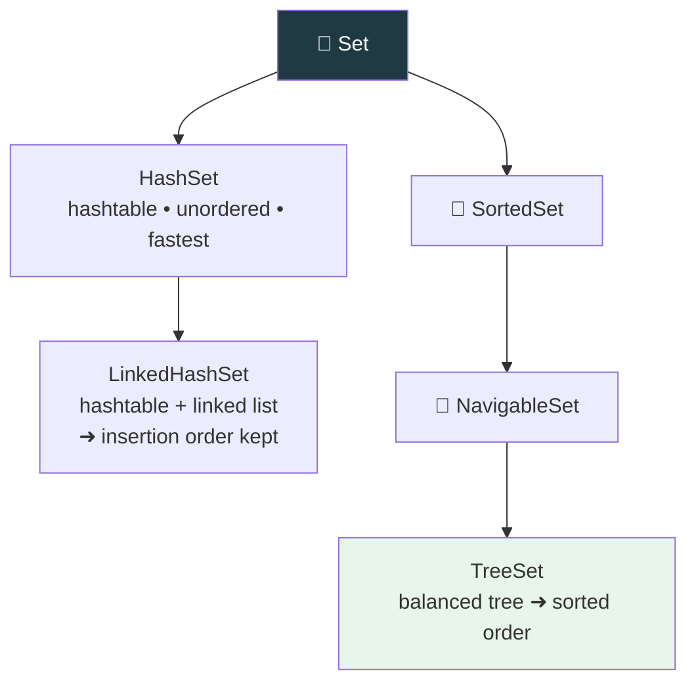
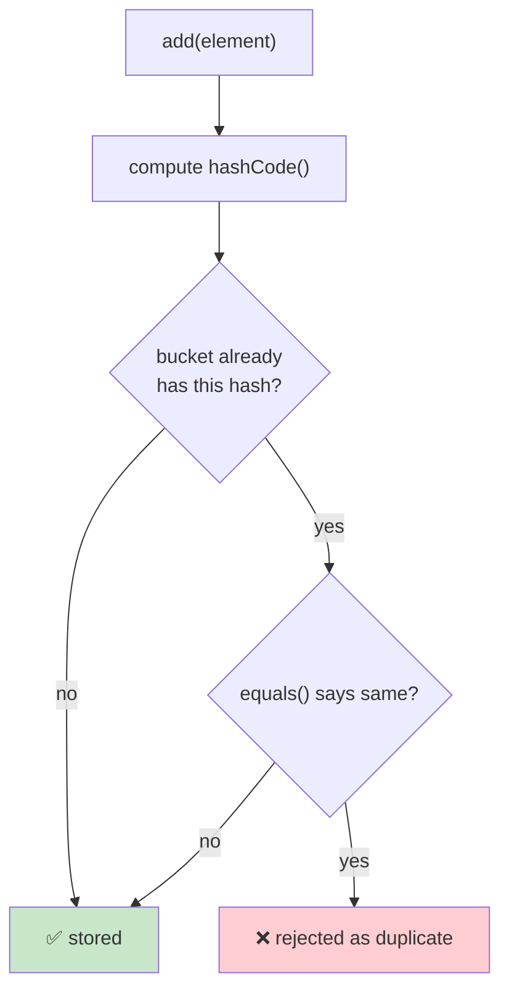

  

---

> **In one line:** An unordered collection that never allows duplicate elements.

## 🧠 1. What Is It?

A **Set** is a child interface of `Collection` that does **not allow duplicate** elements. Most implementations do not preserve insertion order.

## 🧩 2. Implementations

## 📋 3. Comparison

| | HashSet | LinkedHashSet | TreeSet |
|---|---|---|---|
| Underlying structure | Hashtable | Hashtable + linked list | Balanced tree |
| Order | Unpredictable | Insertion order | Sorted (natural or custom) |
| Duplicates | ❌ | ❌ | ❌ |
| `null` allowed | ✅ One | ✅ One | ❌ Throws `NullPointerException` |
| Performance | Fastest | Slightly slower | Slowest (sorting cost) |
| Introduced | 1.2 | 1.4 | 1.2 |

## ⚙️ 4. How Duplicates Are Blocked

This is exactly why `equals()` and `hashCode()` must be overridden together for custom objects.

## 📌 5. Important Rules

- `TreeSet` elements must be **comparable**, otherwise a `ClassCastException` is thrown at runtime.
- `TreeSet` does not accept `null` because it must compare every element.
- `add()` returns `false` when the element is already present.

## 🔁 6. Quick Revision

> Set = no duplicates. HashSet ➜ fast & unordered, LinkedHashSet ➜ insertion order, TreeSet ➜ sorted.

---

<a href="02-List-Interface.md">⬅️ List Interface</a> &nbsp;•&nbsp; <a href="../README.md">🏠 Home</a> &nbsp;•&nbsp; <a href="04-Map-Interface.md">Map Interface ➡️</a>

📘 Core Java Theory Notes • Maintained by <b>Kundan</b>

