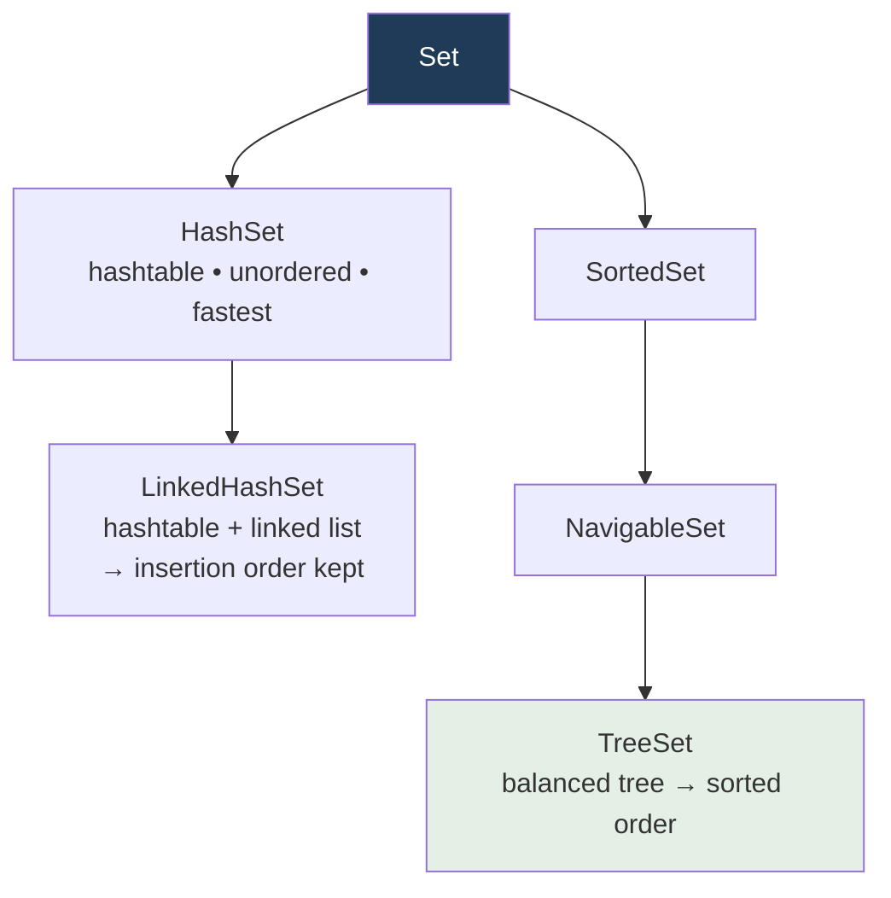
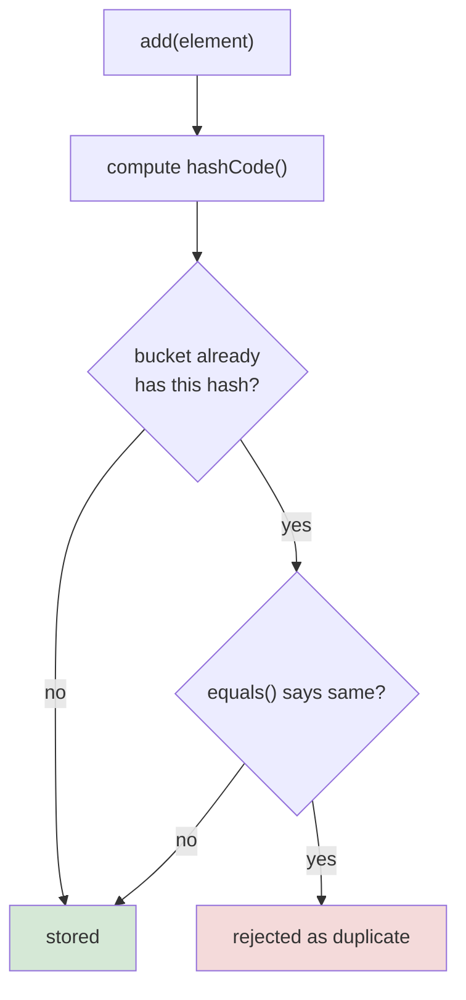

  

---

> **In one line:** An unordered collection that never allows duplicate elements.

## 1. What Is It?

A **Set** is a child interface of `Collection` that does **not allow duplicate** elements. Most implementations do not preserve insertion order.

## 2. Implementations

## 3. Comparison

| | HashSet | LinkedHashSet | TreeSet |
|---|---|---|---|
| Underlying structure | Hashtable | Hashtable + linked list | Balanced tree |
| Order | Unpredictable | Insertion order | Sorted (natural or custom) |
| Duplicates | No | No | No |
| `null` allowed | One | One | Throws `NullPointerException` |
| Performance | Fastest | Slightly slower | Slowest (sorting cost) |
| Introduced | 1.2 | 1.4 | 1.2 |

## 4. How Duplicates Are Blocked

This is exactly why `equals()` and `hashCode()` must be overridden together for custom objects.

## 5. Important Rules

- `TreeSet` elements must be **comparable**, otherwise a `ClassCastException` is thrown at runtime.
- `TreeSet` does not accept `null` because it must compare every element.
- `add()` returns `false` when the element is already present.

## 6. In Depth

A `HashSet` is really a `HashMap` with a constant dummy value, so everything about hashing applies directly to it.

**How a hash lookup works.** The key's `hashCode()` is computed and spread, then reduced to a bucket index. Within that bucket, candidates are compared using `equals()`. With a good hash function, both adding and searching are constant time on average. When many keys collide, the bucket degrades into a list — and since Java 8 a heavily collided bucket is converted into a balanced tree, limiting worst-case lookup to O(log n).

**Resizing.** The default capacity is 16 with a load factor of 0.75, so the table doubles once it is three-quarters full, rehashing every element. Sizing the set correctly up front avoids repeated rehashing when the element count is known.

**This is why the equals/hashCode contract matters.** An object whose `hashCode()` changes after insertion is stored in one bucket and searched for in another, so it appears to vanish from the set even though it is still in memory. Elements used in hash-based collections should therefore be immutable in the fields that define their identity.

`TreeSet` takes a different approach entirely: it maintains a red-black tree ordered by `Comparable` or a supplied `Comparator`, giving sorted iteration and range queries such as `headSet()`, `tailSet()`, `first()` and `ceiling()`, at O(log n) per operation. It rejects `null` because every element must be comparable.

## 7. Quick Revision

> Set = no duplicates. HashSet → fast & unordered, LinkedHashSet → insertion order, TreeSet → sorted.

---

<a href="02-List-Interface.md">← List Interface</a> &nbsp;•&nbsp; <a href="../README.md">Home</a> &nbsp;•&nbsp; <a href="04-Map-Interface.md">Map Interface →</a>

Core Java Theory Notes • Maintained by <b>Kundan</b>

