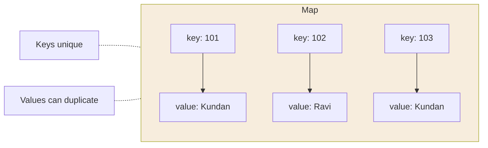

  

---

> **In one line:** A Map stores key–value pairs with unique keys, outside the Collection hierarchy.

## 1. What Is It?

A **Map** stores data as **key–value pairs**. Keys must be **unique**; values may repeat. A Map is **not** a child of `Collection` — it forms its own branch.

## 2. Structure

## 3. Implementations

| | HashMap | LinkedHashMap | TreeMap | Hashtable |
|---|---|---|---|---|
| Order | Unordered | Insertion order | Sorted by key | Unordered |
| Structure | Hashtable | Hashtable + linked list | Balanced tree |Hashtable |
| Synchronized | No | No | No | Yes |
| `null` key | One | One | No | No |
| `null` values | Many | Many | Many | No |
| Introduced | 1.2 | 1.4 | 1.2 | 1.0 (legacy) |

> `IdentityHashMap` compares keys with `==` instead of `.equals()`, and `WeakHashMap` lets the garbage collector reclaim keys that are no longer referenced elsewhere.

## 4. Common Operations

| Method | Purpose |
|---|---|
| `put(k, v)` | Adds or replaces a pair |
| `get(k)` | Returns the value, or `null` |
| `remove(k)` | Deletes the pair |
| `containsKey(k)` / `containsValue(v)` | Membership checks |
| `keySet()` | All keys as a Set |
| `values()` | All values as a Collection |
| `entrySet()` | All key–value pairs for iteration |

## 5. Important Rules

- Inserting an existing key **replaces** the old value and returns it.
- A key used in a `HashMap` should have a correct `hashCode()` and `equals()`.
- `TreeMap` keys must be comparable and cannot be `null`.

## 6. In Depth

`Map` is deliberately outside the `Collection` hierarchy because its element is a **pair**, not a single value. The three view methods — `keySet()`, `values()` and `entrySet()` — bridge the two worlds, and they are **views**, not copies: removing from the key set removes the entry from the map itself.

**Iterating with `entrySet()`** is the efficient choice, because using `keySet()` and then calling `get()` for each key performs a second lookup per entry.

**`HashMap` internals** are the same hashing mechanism described for `HashSet`: buckets, a 0.75 load factor, resizing by doubling and tree-ification of heavily collided buckets since Java 8. It permits one `null` key, which it stores in bucket zero.

**`Hashtable` versus `ConcurrentHashMap`.** `Hashtable` synchronises every method on a single lock, so only one thread can touch the map at a time. `ConcurrentHashMap` locks only the affected bucket, allowing genuine parallel reads and writes, and is the correct choice for concurrent code today. `Collections.synchronizedMap()` sits in between, wrapping an existing map with a single lock.

Java 8 added methods that eliminate common boilerplate: `getOrDefault()`, `putIfAbsent()`, `computeIfAbsent()`, `merge()` and `forEach()`. `computeIfAbsent()` is particularly useful for building a map of lists in one line instead of a null check followed by a put.

## 7. Quick Revision

> Map = unique keys → values. HashMap → fast, LinkedHashMap → ordered, TreeMap → sorted, Hashtable → legacy synchronized.

---

<a href="03-Set-Interface.md">← Set Interface</a> &nbsp;•&nbsp; <a href="../README.md">Home</a> &nbsp;•&nbsp; <a href="05-Cursors-and-Sorting.md">Cursors and Sorting →</a>

Core Java Theory Notes • Maintained by <b>Kundan</b>

