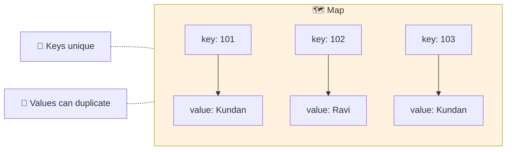

  

---

> **In one line:** A Map stores key–value pairs with unique keys, outside the Collection hierarchy.

## 🧠 1. What Is It?

A **Map** stores data as **key–value pairs**. Keys must be **unique**; values may repeat. A Map is **not** a child of `Collection` — it forms its own branch.

## 🧩 2. Structure

## 📋 3. Implementations

| | HashMap | LinkedHashMap | TreeMap | Hashtable |
|---|---|---|---|---|
| Order | Unordered | Insertion order | Sorted by key | Unordered |
| Structure | Hashtable | Hashtable + linked list | Balanced tree |Hashtable |
| Synchronized | ❌ No | ❌ No | ❌ No | ✅ Yes |
| `null` key | ✅ One | ✅ One | ❌ No | ❌ No |
| `null` values | ✅ Many | ✅ Many | ✅ Many | ❌ No |
| Introduced | 1.2 | 1.4 | 1.2 | 1.0 (legacy) |

> `IdentityHashMap` compares keys with `==` instead of `.equals()`, and `WeakHashMap` lets the garbage collector reclaim keys that are no longer referenced elsewhere.

## ⚙️ 4. Common Operations

| Method | Purpose |
|---|---|
| `put(k, v)` | Adds or replaces a pair |
| `get(k)` | Returns the value, or `null` |
| `remove(k)` | Deletes the pair |
| `containsKey(k)` / `containsValue(v)` | Membership checks |
| `keySet()` | All keys as a Set |
| `values()` | All values as a Collection |
| `entrySet()` | All key–value pairs for iteration |

## 📌 5. Important Rules

- Inserting an existing key **replaces** the old value and returns it.
- A key used in a `HashMap` should have a correct `hashCode()` and `equals()`.
- `TreeMap` keys must be comparable and cannot be `null`.

## 🔁 6. Quick Revision

> Map = unique keys ➜ values. HashMap ➜ fast, LinkedHashMap ➜ ordered, TreeMap ➜ sorted, Hashtable ➜ legacy synchronized.

---

<a href="03-Set-Interface.md">⬅️ Set Interface</a> &nbsp;•&nbsp; <a href="../README.md">🏠 Home</a> &nbsp;•&nbsp; <a href="05-Cursors-and-Sorting.md">Cursors and Sorting ➡️</a>

📘 Core Java Theory Notes • Maintained by <b>Kundan</b>

