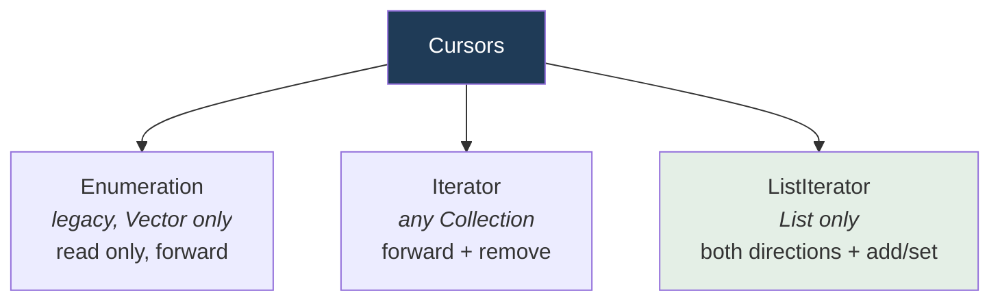
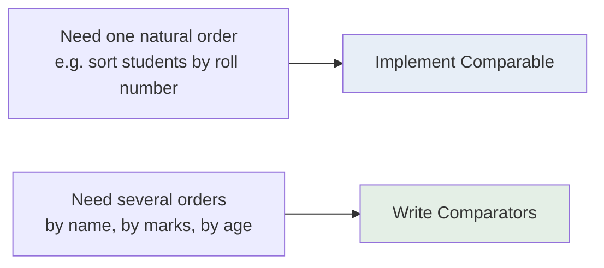

  

---

> **In one line:** Iterator, ListIterator and Enumeration walk a collection; Comparable and Comparator sort it.

## 1. What Is It?

**Cursors** are objects used to retrieve elements from a collection one at a time. **Comparable** and **Comparator** define how elements are ordered.

## 2. The Three Cursors

| | Enumeration | Iterator | ListIterator |
|---|---|---|---|
| Applies to | Legacy classes (Vector) | Any Collection | List only |
| Direction | Forward | Forward | Forward and backward |
| Can remove | No | Yes | Yes |
| Can add / replace | No | No | Yes |
| Methods | `hasMoreElements()`, `nextElement()` | `hasNext()`, `next()`, `remove()` | plus `hasPrevious()`, `previous()`, `add()`, `set()` |
| Obtained from | `v.elements()` | `c.iterator()` | `list.listIterator()` |

## 3. Comparable vs Comparator

| | Comparable | Comparator |
|---|---|---|
| Package | `java.lang` | `java.util` |
| Method | `compareTo(Object)` | `compare(Object, Object)` |
| Sorting type | **Natural / default** order | **Custom** order |
| Where written | Inside the class itself | In a separate class or lambda |
| Number of orders | Only one | Many, one per Comparator |
| Used by | `Collections.sort(list)`, `TreeSet`, `TreeMap` | `Collections.sort(list, comparator)` |

## 4. Return Value Meaning

| Result | Meaning |
|---|---|
| Negative | First object comes **before** the second |
| Zero | Both are considered **equal** |
| Positive | First object comes **after** the second |

## 5. The Collections Utility Class

`java.util.Collections` provides static helpers: `sort()`, `reverse()`, `shuffle()`, `max()`, `min()`, `binarySearch()`, `unmodifiableList()` and `synchronizedList()`.

## 6. Important Rules

- Modifying a collection while iterating it throws `ConcurrentModificationException` — remove through the iterator instead.
- `TreeSet` and `TreeMap` rely on `Comparable` unless a `Comparator` is supplied at construction.

## 7. In Depth

**Fail-fast iteration** explains the most common collection exception. Each collection keeps a modification counter, and the iterator records its value when it is created. If the collection is structurally modified through any route other than the iterator, the counters diverge and the next call throws `ConcurrentModificationException`. This is a bug-detection mechanism, not a guarantee: it is best-effort and must never be relied upon for thread safety. The concurrent collections use **fail-safe** iteration instead, working over a snapshot, so they never throw but may not show the newest changes.

**Sorting stability** matters when records are sorted more than once. `Collections.sort()` uses TimSort, which is stable: elements comparing equal keep their original relative order, so sorting by name and then by department leaves each department's names still in order. Primitive arrays use a dual-pivot quicksort, which is faster but not stable — irrelevant for numbers, which are indistinguishable when equal.

**The comparison contract.** A comparator must be consistent: if `compare(a, b)` is negative then `compare(b, a)` must be positive, and the ordering must be transitive. Breaking this produces `IllegalArgumentException: Comparison method violates its general contract`. Subtracting two integers to build a comparator is a classic trap because it overflows for large values; `Integer.compare()` is the safe form.

Java 8 made comparators far more readable: `Comparator.comparing(Employee::getName).thenComparing(Employee::getSalary).reversed()` replaces an entire anonymous class.

## 8. Quick Revision

> Enumeration (legacy) → Iterator (universal) → ListIterator (List, two-way). Comparable = one natural order; Comparator = many custom orders.

---

<a href="04-Map-Interface.md">← Map Interface</a> &nbsp;•&nbsp; <a href="../README.md">Home</a> &nbsp;•&nbsp; <a href="../09-Multi-Threading/README.md">Multi-Threading →</a>

Core Java Theory Notes • Maintained by <b>Kundan</b>

