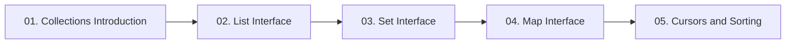

  

---

> Growable, ready-made data structures that overcome every limitation of arrays — List, Set, Queue, Map and the cursors that walk them.

## 📚 Topics In This Chapter

| # | Topic | What you will learn |
|---|---|---|
| 01 | [Collections Introduction](./01-Collections-Introduction.md) | Array limitations, the Collection hierarchy and core interfaces |
| 02 | [List Interface](./02-List-Interface.md) | ArrayList, LinkedList, Vector and Stack compared |
| 03 | [Set Interface](./03-Set-Interface.md) | HashSet, LinkedHashSet, SortedSet and TreeSet |
| 04 | [Map Interface](./04-Map-Interface.md) | HashMap, LinkedHashMap, TreeMap, Hashtable and IdentityHashMap |
| 05 | [Cursors and Sorting](./05-Cursors-and-Sorting.md) | Walking collections and sorting with Comparable and Comparator |

## 🗺️ Learning Path

---

<a href="../07-Packages-Wrapper-Exceptions/README.md">⬅️ Exception Handling</a> &nbsp;•&nbsp; <a href="../README.md">🏠 Home</a> &nbsp;•&nbsp; <a href="../09-Multi-Threading/README.md">Multi-Threading ➡️</a>

📘 Core Java Theory Notes • Maintained by <b>Kundan</b>

