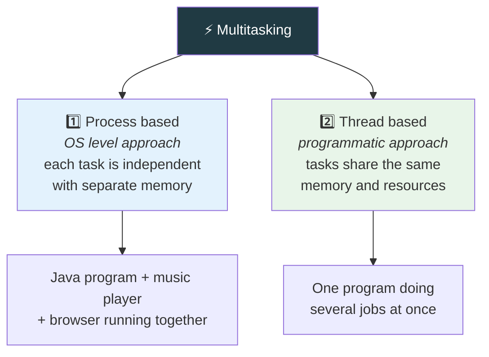

  

---

> **In one line:** Executing many tasks at once, either process based or thread based.

## 🧠 1. What Is It?

**Single tasking** means executing one task at a time. Much of the processor time is wasted because waiting time is very high and the response is late (example: DOS).

**Multitasking** means executing multiple tasks simultaneously. Processor time is used properly, waiting time drops and the response is faster (example: Windows — just as a student can listen and write at the same time).

## 🧩 2. Two Ways To Achieve Multitasking

| | Process based | Thread based |
|---|---|---|
| Unit | Process (heavyweight) | Thread (lightweight) |
| Memory | Separate for each | Shared within the process |
| Managed by | Operating system | The program / JVM |
| Switching cost | High | Low |

## 🧵 3. What Is A Thread?

A **thread** is the smallest independent unit of execution inside a program. Every Java program starts with one thread created by the JVM, called the **main thread**.

## ✅ 4. Advantages Of Multithreading

- Reduces waiting time and improves responsiveness.
- Uses the processor efficiently.
- Threads share memory, so they are cheap compared to processes.
- One thread's exception does not necessarily stop the others.

## 🔁 5. Quick Revision

> Single tasking wastes the CPU. Multitasking = process based (OS) or thread based (program). Threads share memory and are lightweight.

---

<a href="../08-Collections-Framework/05-Cursors-and-Sorting.md">⬅️ Cursors and Sorting</a> &nbsp;•&nbsp; <a href="../README.md">🏠 Home</a> &nbsp;•&nbsp; <a href="02-Thread-Creation.md">Thread Creation ➡️</a>

📘 Core Java Theory Notes • Maintained by <b>Kundan</b>

