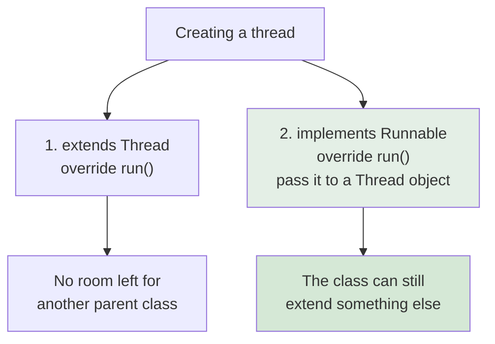
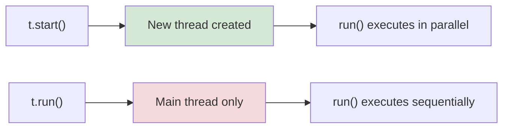

<div align="center">


  

</div>

---

> **In one line:** A thread is created either by extending Thread or by implementing Runnable.

## 1. What Is It?

A user defined thread is created in two ways.

## 2. Two Approaches



## 3. Syntax

```java
class MyThread extends Thread {
    public void run() { }
}

class MyTask implements Runnable {
    public void run() { }
}
```

Starting them:

```java
new MyThread().start();
new Thread(new MyTask()).start();
```

## 4. start() vs run()

| Call | What happens |
|---|---|
| `start()` | Registers a **new thread** with the JVM, which then calls `run()` — real multithreading |
| `run()` | Just an ordinary method call on the **current** thread — no new thread at all |



## 5. Important Rules

- `Runnable` is the preferred approach because Java allows only one parent class.
- Calling `start()` twice on the same thread throws `IllegalThreadStateException`.
- Thread priority ranges from `MIN_PRIORITY` 1 to `MAX_PRIORITY` 10, with `NORM_PRIORITY` 5 as the default; priority is only a **hint** to the scheduler.

## 6. In Depth

Implementing `Runnable` is preferred for reasons deeper than the single-inheritance limit. It separates the **task** from the **worker**, and that separation is what allows the same task object to be submitted to a thread pool, scheduled for later, or executed on the calling thread in a test. Extending `Thread` fuses the two and forces a new thread for every task.

In production code, threads are rarely created directly at all. An `ExecutorService` maintains a pool of reusable worker threads and a queue of pending tasks, which caps resource usage and removes the cost of creating a thread per task.

| Type | Returns a value | Can throw a checked exception |
|---|---|---|
| `Runnable` | No | No |
| `Callable<V>` | Yes | Yes | Submitting a `Callable` returns a `Future`, whose `get()` blocks until the result is available. `CompletableFuture` extends this with non-blocking composition, so several asynchronous steps can be chained without any thread waiting.

Thread **priority** is only a hint and is mapped differently by each operating system, so correctness must never depend on it. Every thread also has a name, useful in logs and stack dumps, and an `UncaughtExceptionHandler`, because an exception escaping `run()` terminates only that thread and would otherwise vanish silently.

## 7. Quick Revision

> Extend `Thread` or implement `Runnable` (preferred). Always call `start()`, never `run()`.

---

<div align="center">

<a href="01-Multitasking.md">← Multitasking</a> &nbsp;•&nbsp; <a href="../README.md">Home</a> &nbsp;•&nbsp; <a href="03-Thread-Life-Cycle.md">Thread Life Cycle →</a>


<sub>Core Java Theory Notes • Maintained by <b>Kundan</b></sub>

</div>
