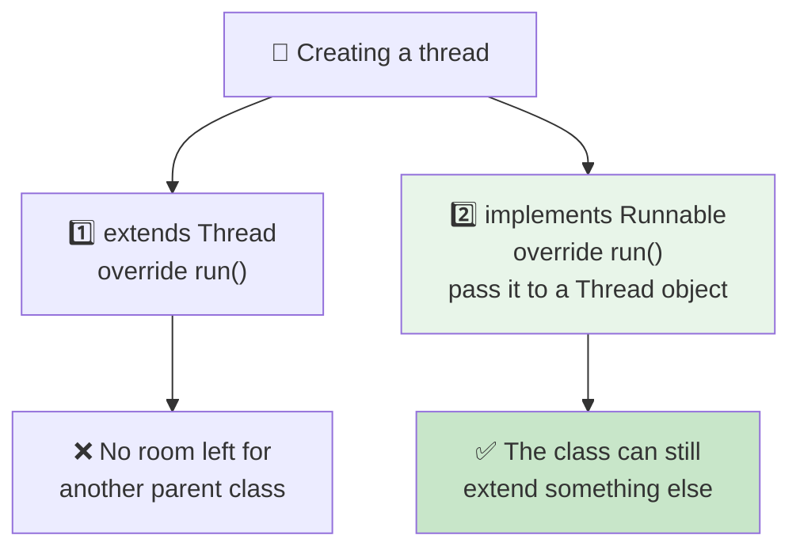
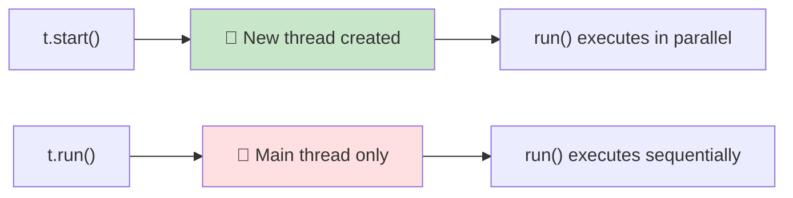

<div align="center">


  

</div>

---

> **In one line:** A thread is created either by extending Thread or by implementing Runnable.

## 🧠 1. What Is It?

A user defined thread is created in two ways.

## 🧩 2. Two Approaches



## 🧾 3. Syntax

```java
class MyThread extends Thread {
    public void run() { }
}

class MyTask implements Runnable {
    public void run() { }
}
```

Starting them:

```java
new MyThread().start();
new Thread(new MyTask()).start();
```

## ⚠️ 4. start() vs run()

| Call | What happens |
|---|---|
| `start()` | Registers a **new thread** with the JVM, which then calls `run()` — real multithreading |
| `run()` | Just an ordinary method call on the **current** thread — no new thread at all |



## 📌 5. Important Rules

- `Runnable` is the preferred approach because Java allows only one parent class.
- Calling `start()` twice on the same thread throws `IllegalThreadStateException`.
- Thread priority ranges from `MIN_PRIORITY` 1 to `MAX_PRIORITY` 10, with `NORM_PRIORITY` 5 as the default; priority is only a **hint** to the scheduler.

## 🔁 6. Quick Revision

> Extend `Thread` or implement `Runnable` (preferred). Always call `start()`, never `run()`.

---

<div align="center">

<a href="01-Multitasking.md">⬅️ Multitasking</a> &nbsp;•&nbsp; <a href="../README.md">🏠 Home</a> &nbsp;•&nbsp; <a href="03-Thread-Life-Cycle.md">Thread Life Cycle ➡️</a>


<sub>📘 Core Java Theory Notes • Maintained by <b>Kundan</b></sub>

</div>
