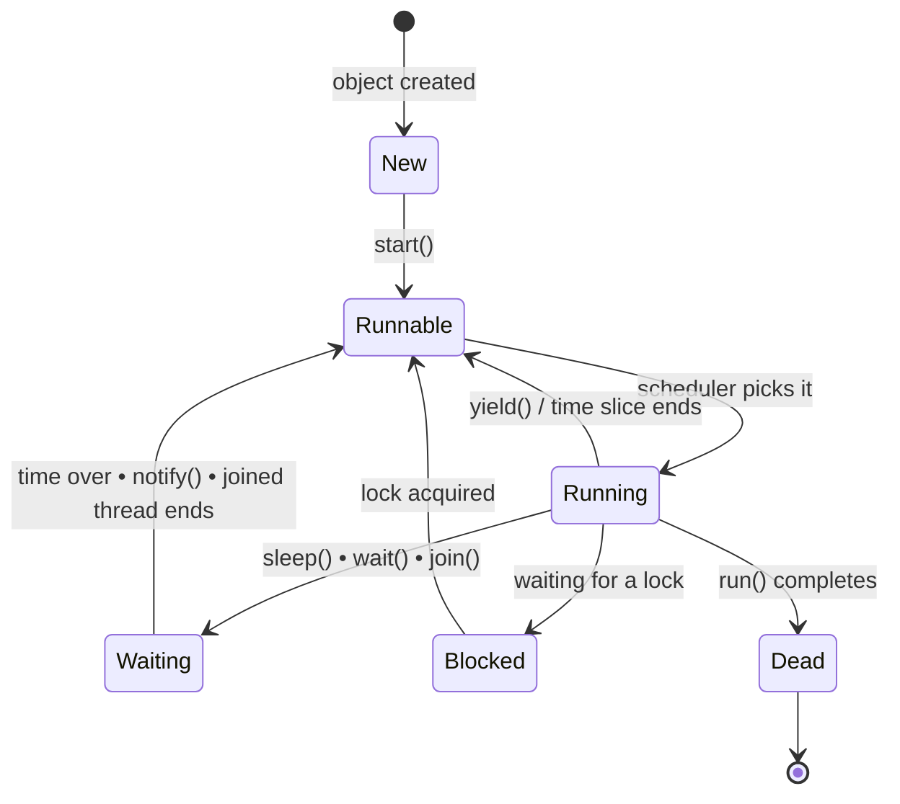

  

---

> **In one line:** A thread moves through New, Runnable, Running, Blocked/Waiting and Dead states.

## 1. What Is It?

From creation to termination a thread passes through a fixed set of states, controlled partly by the program and partly by the **thread scheduler**.

## 2. Life Cycle Diagram

## 3. State By State

| State | Meaning |
|---|---|
| **New** | The thread object exists but `start()` has not been called |
| **Runnable** | Ready to run, waiting for the scheduler to pick it |
| **Running** | Currently executing `run()` |
| **Blocked / Waiting** | Temporarily inactive — sleeping, waiting for a lock or waiting for a notification |
| **Dead / Terminated** | `run()` has finished, or the thread was stopped |

## 4. Methods That Change The State

| Method | Effect |
|---|---|
| `start()` | New → Runnable |
| `sleep(ms)` | Running → Waiting for a fixed time, keeps the lock |
| `wait()` | Running → Waiting, **releases** the lock |
| `notify()` / `notifyAll()` | Wakes one or all waiting threads |
| `join()` | Makes the current thread wait until another finishes |
| `yield()` | Hints that the thread is willing to pause |

## 5. Important Rules

- A **dead** thread can never be started again.
- `sleep()` and `join()` throw `InterruptedException`, so they must be handled.
- `sleep()` keeps the lock; `wait()` gives it up — the single most asked difference.

## 6. In Depth

Java's own `Thread.State` enum names six states, which map onto the classic diagram and are worth knowing precisely because a thread dump reports them.

| State | Meaning |
|---|---|
| `NEW` | Created, `start()` not yet called |
| `RUNNABLE` | Eligible to run; may be running or waiting for a CPU |
| `BLOCKED` | Waiting to acquire a monitor lock |
| `WAITING` | Waiting indefinitely after `wait()`, `join()` or `park()` |
| `TIMED_WAITING` | Waiting with a deadline after `sleep(n)` or `wait(n)` |
| `TERMINATED` | `run()` has finished | Note that Java does not distinguish "runnable" from "running"; both appear as `RUNNABLE`, because whether the thread currently holds a CPU is the operating system's business.

**The distinction that matters most** is between `BLOCKED` and `WAITING`. A blocked thread wants a lock someone else holds and will proceed automatically when that lock is released. A waiting thread has voluntarily given up and will only continue when another thread notifies it — which is why a missing `notify()` leaves a thread waiting forever.

`interrupt()` is the cooperative way to ask a thread to stop. It sets a flag, and any thread currently sleeping or waiting throws `InterruptedException`. The thread itself decides how to respond; the old `stop()` and `suspend()` methods were deprecated precisely because they terminated threads at arbitrary points, leaving shared data in a half-modified state.

## 7. Quick Revision

> New → Runnable → Running → (Waiting/Blocked) → Dead. `start()` once, `sleep()` keeps the lock, `wait()` releases it.

---

<a href="02-Thread-Creation.md">← Thread Creation</a> &nbsp;•&nbsp; <a href="../README.md">Home</a> &nbsp;•&nbsp; <a href="04-Synchronization.md">Synchronization →</a>

Core Java Theory Notes • Maintained by <b>Kundan</b>

