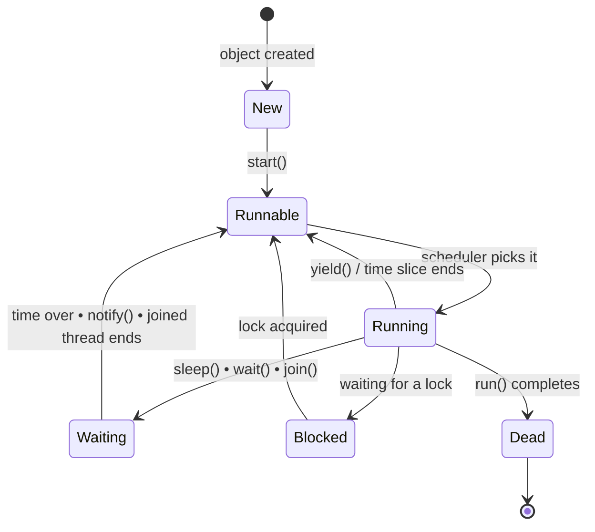

  

---

> **In one line:** A thread moves through New, Runnable, Running, Blocked/Waiting and Dead states.

## 🧠 1. What Is It?

From creation to termination a thread passes through a fixed set of states, controlled partly by the program and partly by the **thread scheduler**.

## 🧩 2. Life Cycle Diagram

## 📋 3. State By State

| State | Meaning |
|---|---|
| **New** | The thread object exists but `start()` has not been called |
| **Runnable** | Ready to run, waiting for the scheduler to pick it |
| **Running** | Currently executing `run()` |
| **Blocked / Waiting** | Temporarily inactive — sleeping, waiting for a lock or waiting for a notification |
| **Dead / Terminated** | `run()` has finished, or the thread was stopped |

## 🧰 4. Methods That Change The State

| Method | Effect |
|---|---|
| `start()` | New ➜ Runnable |
| `sleep(ms)` | Running ➜ Waiting for a fixed time, keeps the lock |
| `wait()` | Running ➜ Waiting, **releases** the lock |
| `notify()` / `notifyAll()` | Wakes one or all waiting threads |
| `join()` | Makes the current thread wait until another finishes |
| `yield()` | Hints that the thread is willing to pause |

## 📌 5. Important Rules

- A **dead** thread can never be started again.
- `sleep()` and `join()` throw `InterruptedException`, so they must be handled.
- `sleep()` keeps the lock; `wait()` gives it up — the single most asked difference.

## 🔁 6. Quick Revision

> New ➜ Runnable ➜ Running ➜ (Waiting/Blocked) ➜ Dead. `start()` once, `sleep()` keeps the lock, `wait()` releases it.

---

<a href="02-Thread-Creation.md">⬅️ Thread Creation</a> &nbsp;•&nbsp; <a href="../README.md">🏠 Home</a> &nbsp;•&nbsp; <a href="04-Synchronization.md">Synchronization ➡️</a>

📘 Core Java Theory Notes • Maintained by <b>Kundan</b>

