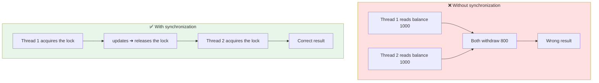
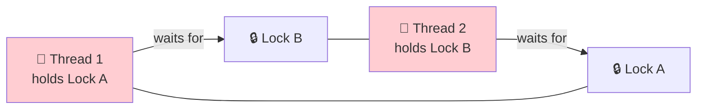

<div align="center">


  

</div>

---

> **In one line:** Locking shared data so that only one thread can modify it at a time.

## 🧠 1. What Is It?

When several threads act on the same object at the same time, a **data inconsistency problem** occurs — one thread reads a value while another is still changing it.

**Thread synchronization** solves this: only **one thread at a time** is allowed inside the protected code, using a **lock (monitor)** that every object carries.

## 🧩 2. The Problem And The Fix



## 🧾 3. Two Forms

| Form | Scope of the lock |
|---|---|
| **Synchronized method** | The whole method is protected |
| **Synchronized block** | Only the critical lines are protected — better performance |

```java
synchronized void withdraw() { }

synchronized (this) { }
```

## 📋 4. Types Of Lock

| Type | Lock held on |
|---|---|
| Instance method | The **object** |
| Static method | The **class** object |

## 💀 5. Deadlock

Deadlock happens when two threads hold one lock each and wait forever for the other's lock.



**Avoiding it:** always acquire locks in the same order, keep synchronized regions small, and prefer timeout-based locking.

## 👻 6. Daemon Threads

A **daemon thread** is a background service thread, such as the garbage collector. The JVM exits as soon as only daemon threads remain, and `setDaemon(true)` must be called **before** `start()`.

## 📌 7. Important Rules

- Synchronization costs performance, so protect only the critical section.
- `synchronized` cannot be applied to variables or constructors.

## 🔁 8. Quick Revision

> Shared data + many threads ➜ inconsistency. `synchronized` gives one-thread-at-a-time access. Circular waiting ➜ deadlock.

---

<div align="center">

<a href="03-Thread-Life-Cycle.md">⬅️ Thread Life Cycle</a> &nbsp;•&nbsp; <a href="../README.md">🏠 Home</a> &nbsp;•&nbsp; <a href="05-Inter-Thread-Communication.md">Inter Thread Communication ➡️</a>


<sub>📘 Core Java Theory Notes • Maintained by <b>Kundan</b></sub>

</div>
