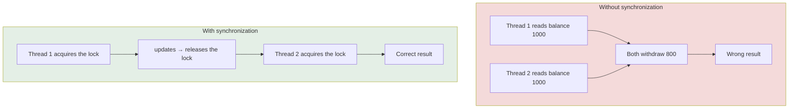
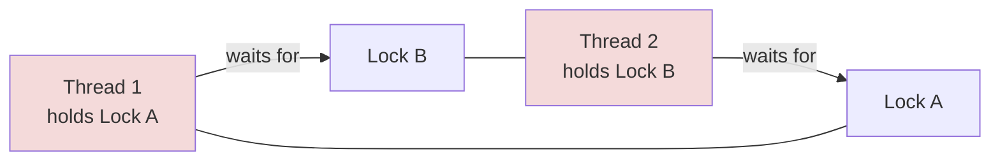

<div align="center">


  

</div>

---

> **In one line:** Locking shared data so that only one thread can modify it at a time.

## 1. What Is It?

When several threads act on the same object at the same time, a **data inconsistency problem** occurs — one thread reads a value while another is still changing it.

**Thread synchronization** solves this: only **one thread at a time** is allowed inside the protected code, using a **lock (monitor)** that every object carries.

## 2. The Problem And The Fix



## 3. Two Forms

| Form | Scope of the lock |
|---|---|
| **Synchronized method** | The whole method is protected |
| **Synchronized block** | Only the critical lines are protected — better performance |

```java
synchronized void withdraw() { }

synchronized (this) { }
```

## 4. Types Of Lock

| Type | Lock held on |
|---|---|
| Instance method | The **object** |
| Static method | The **class** object |

## 5. Deadlock

Deadlock happens when two threads hold one lock each and wait forever for the other's lock.



**Avoiding it:** always acquire locks in the same order, keep synchronized regions small, and prefer timeout-based locking.

## 6. Daemon Threads

A **daemon thread** is a background service thread, such as the garbage collector. The JVM exits as soon as only daemon threads remain, and `setDaemon(true)` must be called **before** `start()`.

## 7. Important Rules

- Synchronization costs performance, so protect only the critical section.
- `synchronized` cannot be applied to variables or constructors.

## 8. In Depth

The reason unsynchronised code fails is not only interleaving but **visibility**. Each CPU core caches values, and without synchronisation a write by one thread may never become visible to another. The Java Memory Model defines when it must: exiting a `synchronized` block flushes changes to main memory, and entering one refreshes the thread's view. `volatile` provides the same visibility guarantee for a single variable without any locking, but it does **not** make compound operations such as `count++` atomic, because that is three separate steps.

**Atomicity, visibility and ordering** are the three guarantees concurrent code needs, and `synchronized` supplies all three. Race conditions arise when a check and an action are separated, so `if (map.get(k) == null) map.put(k, v)` is unsafe even with a thread-safe map; the whole sequence must be atomic, which is what `putIfAbsent()` provides.

**Deadlock requires four conditions simultaneously** — mutual exclusion, hold and wait, no preemption, and circular waiting — so breaking any one prevents it. The practical technique is a global lock ordering: if every thread acquires locks in the same order, no cycle can form. Related failures are **livelock**, where threads keep responding to each other and make no progress, and **starvation**, where one thread never gets a turn.

Modern alternatives are usually better than hand-written locks: the atomic classes such as `AtomicInteger` use lock-free compare-and-swap; `ReentrantLock` adds try-lock with timeout and fairness options; and the concurrent collections handle their own internal synchronisation. The best strategy of all is to avoid shared mutable state — using immutable objects or confining data to one thread removes the problem rather than managing it.

## 9. Quick Revision

> Shared data + many threads → inconsistency. `synchronized` gives one-thread-at-a-time access. Circular waiting → deadlock.

---

<div align="center">

<a href="03-Thread-Life-Cycle.md">← Thread Life Cycle</a> &nbsp;•&nbsp; <a href="../README.md">Home</a> &nbsp;•&nbsp; <a href="05-Inter-Thread-Communication.md">Inter Thread Communication →</a>


<sub>Core Java Theory Notes • Maintained by <b>Kundan</b></sub>

</div>
