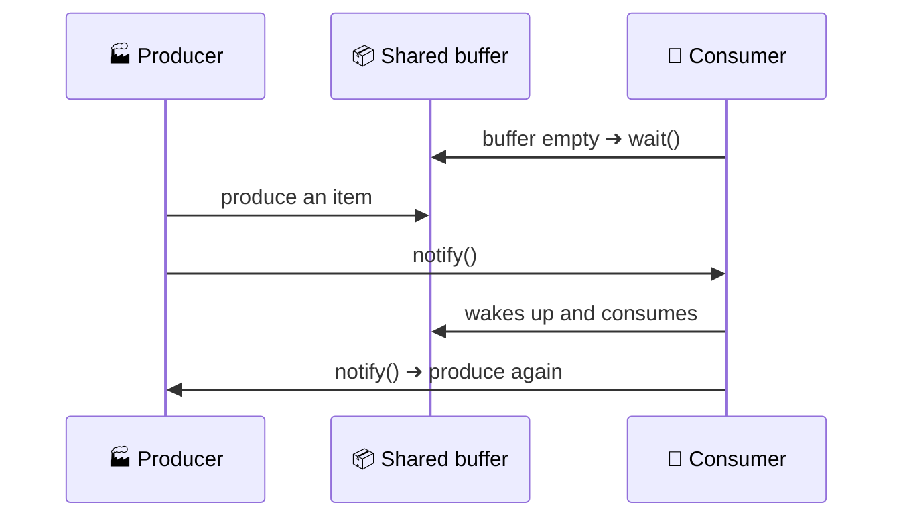

  

---

> **In one line:** wait, notify and notifyAll let cooperating threads hand control to each other.

## 🧠 1. What Is It?

Inter-thread communication lets one thread **pause** until another thread signals that it may continue. It is provided by three final methods of the `Object` class: `wait()`, `notify()` and `notifyAll()`.

## 🧩 2. Producer–Consumer Flow

## 📋 3. The Three Methods

| Method | Effect |
|---|---|
| `wait()` | Releases the lock and puts the thread in the waiting state |
| `notify()` | Wakes **one** waiting thread |
| `notifyAll()` | Wakes **all** waiting threads |

## 📌 4. Important Rules

- All three are defined in `Object`, not in `Thread`, because the lock belongs to the object.
- They must be called from **inside a synchronized** method or block, otherwise `IllegalMonitorStateException` is thrown.
- A notified thread does not run immediately — it waits to reacquire the lock.

## ⚖️ 5. wait() vs sleep()

| | `wait()` | `sleep()` |
|---|---|---|
| Defined in | `Object` | `Thread` |
| Releases the lock | ✅ Yes | ❌ No |
| Wakes up when | Notified (or timeout) | Time expires |
| Must be synchronized | ✅ Yes | ❌ No |

## 🔁 6. Quick Revision

> `wait()` releases the lock and pauses; `notify()` / `notifyAll()` wake it. Always inside `synchronized`, always from `Object`.

---

<a href="04-Synchronization.md">⬅️ Synchronization</a> &nbsp;•&nbsp; <a href="../README.md">🏠 Home</a> &nbsp;•&nbsp; <a href="../10-File-Handling/README.md">File Handling ➡️</a>

📘 Core Java Theory Notes • Maintained by <b>Kundan</b>

