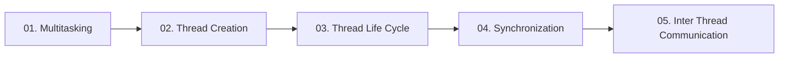

  

---

> Running several tasks at the same time: multitasking, thread creation, the thread life cycle, synchronization and inter-thread communication.

## 📚 Topics In This Chapter

| # | Topic | What you will learn |
|---|---|---|
| 01 | [Multitasking](./01-Multitasking.md) | Single tasking, multitasking and the two ways to achieve it |
| 02 | [Thread Creation](./02-Thread-Creation.md) | The two ways to define a thread and why start() matters |
| 03 | [Thread Life Cycle](./03-Thread-Life-Cycle.md) | The five states a thread passes through |
| 04 | [Synchronization](./04-Synchronization.md) | Preventing data inconsistency with locks, and avoiding deadlock |
| 05 | [Inter Thread Communication](./05-Inter-Thread-Communication.md) | How threads cooperate using wait, notify and notifyAll |

## 🗺️ Learning Path

---

<a href="../08-Collections-Framework/README.md">⬅️ Cursors and Sorting</a> &nbsp;•&nbsp; <a href="../README.md">🏠 Home</a> &nbsp;•&nbsp; <a href="../10-File-Handling/README.md">File Handling ➡️</a>

📘 Core Java Theory Notes • Maintained by <b>Kundan</b>

