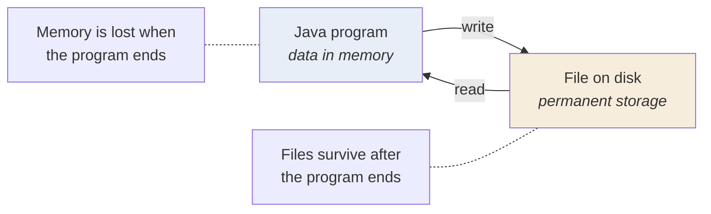

  

---

> **In one line:** Performing operations such as creating, reading, writing and deleting files.

## 1. What Is It?

File handling is a crucial part of any programming language. It means performing various operations on a file — reading, writing, editing and more.

Common file handling operations:

- Creating a new file
- Writing data into a file
- Reading data from an existing file
- Deleting a file

Java provides library classes and methods to do this easily. Almost all of them live in the **`java.io`** package, which must be imported before use.

## 2. Where File Handling Fits

## 3. Why It Is Needed

| Reason | Explanation |
|---|---|
| **Persistence** | Data stays available after the program stops |
| **Sharing** | Other programs and people can use the same file |
| **Volume** | Large data sets cannot be typed in each run |
| **Logging and configuration** | Real applications read settings and write logs |

## 4. In Depth

File handling is where a program stops being self-contained and starts depending on the outside world, so it introduces a category of failure that ordinary code does not have: the file may be missing, locked, read-only, on a full disk, or on a network share that disappears mid-write. This is exactly why most `java.io` operations declare **checked exceptions** — the compiler forces the program to acknowledge that these things happen.

Java offers two generations of API:

- **`java.io`** (since 1.0) — the `File` class and the stream hierarchy. Simple, universally understood, but its error reporting is poor, since methods such as `delete()` return `false` without saying why.
- **`java.nio.file`** (since Java 7) — `Path`, `Files` and `FileSystems`. It throws descriptive exceptions, supports symbolic links, file attributes and permissions, can walk directory trees, and offers one-line operations such as `Files.readAllLines()`, `Files.write()` and `Files.copy()`.

New code should generally prefer `java.nio.file`, while `java.io` remains essential to understand because streams underpin both, and because so much existing code and so many libraries use it.

A separate concern is **resource management**. Every open file consumes an operating system handle, and those are limited. A file left open may also keep data sitting in a buffer, unwritten. This is why every example closes its streams, and why `try-with-resources` is the standard modern form.

## 5. Quick Revision

> File handling = create, read, write, delete — all through `java.io`, using streams.

---

<a href="../09-Multi-Threading/05-Inter-Thread-Communication.md">← Inter Thread Communication</a> &nbsp;•&nbsp; <a href="../README.md">Home</a> &nbsp;•&nbsp; <a href="02-Streams.md">Streams →</a>

Core Java Theory Notes • Maintained by <b>Kundan</b>

