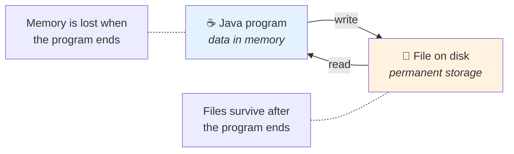

  

---

> **In one line:** Performing operations such as creating, reading, writing and deleting files.

## 🧠 1. What Is It?

File handling is a crucial part of any programming language. It means performing various operations on a file — reading, writing, editing and more.

Common file handling operations:

- Creating a new file
- Writing data into a file
- Reading data from an existing file
- Deleting a file

Java provides library classes and methods to do this easily. Almost all of them live in the **`java.io`** package, which must be imported before use.

## 🧩 2. Where File Handling Fits

## 📋 3. Why It Is Needed

| Reason | Explanation |
|---|---|
| **Persistence** | Data stays available after the program stops |
| **Sharing** | Other programs and people can use the same file |
| **Volume** | Large data sets cannot be typed in each run |
| **Logging and configuration** | Real applications read settings and write logs |

## 🔁 4. Quick Revision

> File handling = create, read, write, delete — all through `java.io`, using streams.

---

<a href="../09-Multi-Threading/05-Inter-Thread-Communication.md">⬅️ Inter Thread Communication</a> &nbsp;•&nbsp; <a href="../README.md">🏠 Home</a> &nbsp;•&nbsp; <a href="02-Streams.md">Streams ➡️</a>

📘 Core Java Theory Notes • Maintained by <b>Kundan</b>

