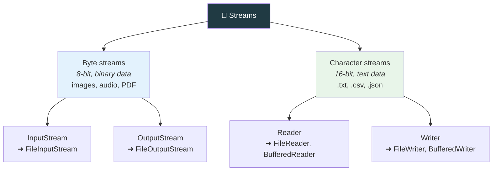
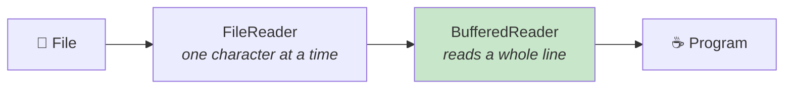

  

---

> **In one line:** A stream is a flow of data between a program and a source or destination.

## 🧠 1. What Is It?

Java performs all file-related operations through **i/o streams**. A stream is a **sequence of data** flowing from a source to a destination — it can be thought of as a pipe carrying bytes or characters.

## 🧩 2. Stream Classification

## 📋 3. Direction

| Direction | Byte stream root | Character stream root |
|---|---|---|
| **Input** (read into the program) | `InputStream` | `Reader` |
| **Output** (write out of the program) | `OutputStream` | `Writer` |

## ⚙️ 4. Buffered Streams

`BufferedReader` and `BufferedWriter` wrap another stream and keep a memory buffer, so the disk is touched far fewer times. This makes reading and writing significantly faster.

## 📌 5. Important Rules

- Use **byte** streams for binary data and **character** streams for text.
- Every stream must be **closed**, ideally with try-with-resources.
- Closing a wrapper stream also closes the stream it wraps.

## 🔁 6. Quick Revision

> Stream = flow of data. Byte ➜ InputStream/OutputStream; Character ➜ Reader/Writer; Buffered ➜ faster.

---

<a href="01-File-Handling-Introduction.md">⬅️ File Handling Introduction</a> &nbsp;•&nbsp; <a href="../README.md">🏠 Home</a> &nbsp;•&nbsp; <a href="03-File-Class.md">File Class ➡️</a>

📘 Core Java Theory Notes • Maintained by <b>Kundan</b>

