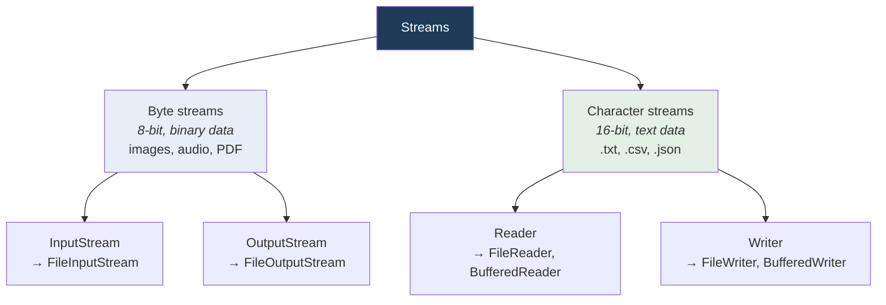
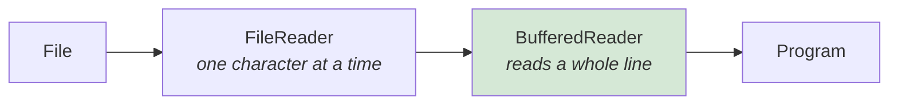

  

---

> **In one line:** A stream is a flow of data between a program and a source or destination.

## 1. What Is It?

Java performs all file-related operations through **i/o streams**. A stream is a **sequence of data** flowing from a source to a destination — it can be thought of as a pipe carrying bytes or characters.

## 2. Stream Classification

## 3. Direction

| Direction | Byte stream root | Character stream root |
|---|---|---|
| **Input** (read into the program) | `InputStream` | `Reader` |
| **Output** (write out of the program) | `OutputStream` | `Writer` |

## 4. Buffered Streams

`BufferedReader` and `BufferedWriter` wrap another stream and keep a memory buffer, so the disk is touched far fewer times. This makes reading and writing significantly faster.

## 5. Important Rules

- Use **byte** streams for binary data and **character** streams for text.
- Every stream must be **closed**, ideally with try-with-resources.
- Closing a wrapper stream also closes the stream it wraps.

## 6. In Depth

The stream hierarchy looks large, but it follows one consistent design: the **decorator pattern**. A low-level stream connects to a source, and each wrapper adds one capability. `new BufferedReader(new InputStreamReader(new FileInputStream(file), "UTF-8"))` reads bytes from a file, converts them to characters using a specified encoding, and buffers the result — three responsibilities, three classes, composed in one line.

**Why byte and character streams are separate.** A byte is not a character. Text must be decoded using a character set, and different sets encode the same character differently. Reading a UTF-8 file as if it were ASCII produces corrupted output, so encoding should always be specified explicitly rather than relying on the platform default, which varies by machine.

**Why buffering matters so much.** Each unbuffered read is a system call reaching the operating system, and a system call costs thousands of times more than a memory access. A buffer turns thousands of tiny reads into a few large ones, routinely improving throughput by an order of magnitude.

**Flushing versus closing.** Written data sits in the buffer until it is full, flushed or the stream is closed. A program that exits without closing can lose the last portion of its output entirely — a silent failure with no exception.

Other useful wrappers include `DataInputStream` and `DataOutputStream` for primitives in a portable binary format, `ObjectOutputStream` for serialisation, and `PrintWriter` for formatted text.

## 7. Quick Revision

> Stream = flow of data. Byte → InputStream/OutputStream; Character → Reader/Writer; Buffered → faster.

---

<a href="01-File-Handling-Introduction.md">← File Handling Introduction</a> &nbsp;•&nbsp; <a href="../README.md">Home</a> &nbsp;•&nbsp; <a href="03-File-Class.md">File Class →</a>

Core Java Theory Notes • Maintained by <b>Kundan</b>

