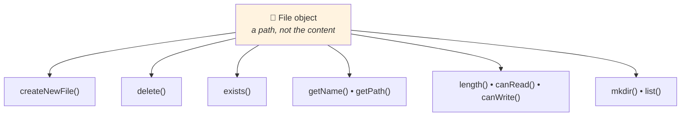

<div align="center">


  

</div>

---

> **In one line:** The File class represents a file or directory path and describes it without reading its content.

## 🧠 1. What Is It?

`java.io.File` is an abstract representation of a **file or directory path name**. Creating a `File` object does **not** create a file on disk — it only points at a location.

## 🧩 2. What A File Object Can Do



## 📋 3. Common Methods

| Method | Purpose |
|---|---|
| `createNewFile()` | Creates an empty file; returns `false` if it already exists |
| `exists()` | Checks whether the file or folder is present |
| `getName()` / `getAbsolutePath()` | Name and full path |
| `length()` | Size in bytes |
| `delete()` | Deletes the file or empty directory |
| `mkdir()` / `mkdirs()` | Creates a directory, or a whole path of them |
| `list()` / `listFiles()` | Contents of a directory |
| `isFile()` / `isDirectory()` | Type check |
| `canRead()` / `canWrite()` | Permission check |

## 🧾 4. Syntax

```java
File f = new File("data.txt");
```

## 📌 5. Important Rules

- `new File(...)` never touches the disk; only methods like `createNewFile()` do.
- Most of these methods throw `IOException`, so they need exception handling.
- `delete()` fails silently by returning `false` — always check the result.

## 🔁 6. Quick Revision

> `File` = a path handle. Use it to create, inspect, list and delete — not to read content.

---

<div align="center">

<a href="02-Streams.md">⬅️ Streams</a> &nbsp;•&nbsp; <a href="../README.md">🏠 Home</a> &nbsp;•&nbsp; <a href="04-FileReader-and-FileWriter.md">FileReader and FileWriter ➡️</a>


<sub>📘 Core Java Theory Notes • Maintained by <b>Kundan</b></sub>

</div>
