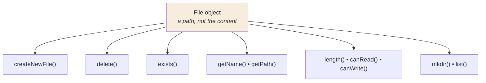

<div align="center">


  

</div>

---

> **In one line:** The File class represents a file or directory path and describes it without reading its content.

## 1. What Is It?

`java.io.File` is an abstract representation of a **file or directory path name**. Creating a `File` object does **not** create a file on disk — it only points at a location.

## 2. What A File Object Can Do



## 3. Common Methods

| Method | Purpose |
|---|---|
| `createNewFile()` | Creates an empty file; returns `false` if it already exists |
| `exists()` | Checks whether the file or folder is present |
| `getName()` / `getAbsolutePath()` | Name and full path |
| `length()` | Size in bytes |
| `delete()` | Deletes the file or empty directory |
| `mkdir()` / `mkdirs()` | Creates a directory, or a whole path of them |
| `list()` / `listFiles()` | Contents of a directory |
| `isFile()` / `isDirectory()` | Type check |
| `canRead()` / `canWrite()` | Permission check |

## 4. Syntax

```java
File f = new File("data.txt");
```

## 5. Important Rules

- `new File(...)` never touches the disk; only methods like `createNewFile()` do.
- Most of these methods throw `IOException`, so they need exception handling.
- `delete()` fails silently by returning `false` — always check the result.

## 6. In Depth

The most important thing to internalise about `File` is that it represents a **path**, not a file. The object can be created for something that does not exist, was deleted a moment ago, or is a directory rather than a file. Every method that touches the disk therefore reports what it found at that instant, and the answer can change immediately afterwards.

This leads to the classic **time-of-check to time-of-use** race: testing `exists()` and then opening the file is not safe, because something may delete or create it in between. The robust approach is to attempt the operation and handle the exception.

The `java.io.File` API has three well-known weaknesses that `java.nio.file.Path` and `Files` were designed to address:

- Methods return `boolean` instead of explaining the failure. `Files.delete()` throws `NoSuchFileException` or `AccessDeniedException` instead.
- There is no support for file attributes, permissions or symbolic links.
- Directory traversal must be written by hand, whereas `Files.walk()` and `Files.newDirectoryStream()` provide it.

Two practical notes: always build paths with `File.separator` or `Paths.get("dir", "file.txt")` rather than hard-coded slashes, since Windows and Unix differ; and `delete()` only removes an **empty** directory, so removing a tree requires walking it depth-first.

## 7. Quick Revision

> `File` = a path handle. Use it to create, inspect, list and delete — not to read content.

---

<div align="center">

<a href="02-Streams.md">← Streams</a> &nbsp;•&nbsp; <a href="../README.md">Home</a> &nbsp;•&nbsp; <a href="04-FileReader-and-FileWriter.md">FileReader and FileWriter →</a>


<sub>Core Java Theory Notes • Maintained by <b>Kundan</b></sub>

</div>
