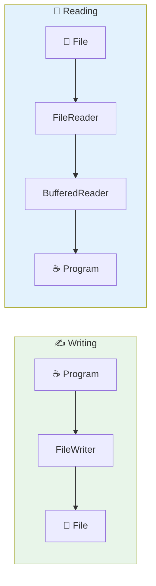

<div align="center">


  

</div>

---

> **In one line:** Character stream classes that read from and write to text files.

## 🧠 1. What Is It?

`FileReader` and `FileWriter` are **character stream** classes used to read and write **text** files.

## 🧩 2. Read And Write Flow



## 🧾 3. Syntax

```java
FileWriter fw = new FileWriter("data.txt");        // overwrite
FileWriter fa = new FileWriter("data.txt", true);  // append

FileReader fr = new FileReader("data.txt");
BufferedReader br = new BufferedReader(fr);
```

## 📋 4. Key Methods

| Class | Method | Purpose |
|---|---|---|
| `FileWriter` | `write(String)` | Writes text |
| `FileWriter` | `flush()` | Pushes buffered data to disk |
| `FileWriter` | `close()` | Flushes and releases the file |
| `FileReader` | `read()` | Reads one character, returns `-1` at the end |
| `BufferedReader` | `readLine()` | Reads a whole line, returns `null` at the end |

## 📌 5. Important Rules

- `new FileWriter(file)` **erases** existing content unless the second argument is `true`.
- If the file does not exist, `FileWriter` creates it.
- Forgetting `close()` or `flush()` can leave the file empty.
- Reading a missing file throws `FileNotFoundException`.

## ✅ 6. Best Practices

- Wrap `FileReader` in a `BufferedReader` for line-by-line reading.
- Use try-with-resources so streams close automatically.

## 🔁 7. Quick Revision

> `FileWriter` writes (append flag matters), `FileReader` + `BufferedReader` reads lines. Always close.

---

<div align="center">

<a href="03-File-Class.md">⬅️ File Class</a> &nbsp;•&nbsp; <a href="../README.md">🏠 Home</a> &nbsp;•&nbsp; <a href="05-Serialization-and-Deserialization.md">Serialization and De-Serialization ➡️</a>


<sub>📘 Core Java Theory Notes • Maintained by <b>Kundan</b></sub>

</div>
