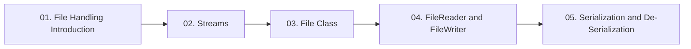

  

---

> Reading, writing and storing data outside the program: streams, the File class, readers and writers, and object serialization.

## Topics In This Chapter

| # | Topic | What you will learn |
|---|---|---|
| 01 | [File Handling Introduction](./01-File-Handling-Introduction.md) | What file handling is and which operations are available |
| 02 | [Streams](./02-Streams.md) | Byte streams, character streams and their class families |
| 03 | [File Class](./03-File-Class.md) | Representing files and folders with java.io.File |
| 04 | [FileReader and FileWriter](./04-FileReader-and-FileWriter.md) | Reading and writing text with character streams |
| 05 | [Serialization and De-Serialization](./05-Serialization-and-Deserialization.md) | Saving and restoring objects with ObjectOutputStream and ObjectInputStream |

## Learning Path

---

<a href="../09-Multi-Threading/README.md">← Inter Thread Communication</a> &nbsp;•&nbsp; <a href="../README.md">Home</a> &nbsp;•&nbsp; <a href="../11-Advanced-Concepts/README.md">Advanced Concepts →</a>

Core Java Theory Notes • Maintained by <b>Kundan</b>

