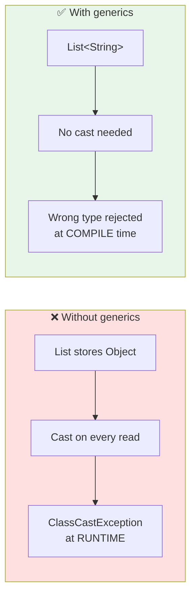

<div align="center">


  

</div>

---

> **In one line:** Generics let a class, interface or method take the data type as a parameter, giving compile-time type safety.

## 🧠 1. What Is It?

**Generics** were introduced in **Java 1.5**. Generic programming lets a programmer create classes, interfaces and methods in which the **type of data is specified as a parameter**.

Generics provide **type safety** — the assurance that an operation is being performed on the right type of data.

> Before generics, generalized classes were written using `Object` references, because `Object` is the super class of everything. That approach did **not** ensure type safety.

## 🧩 2. Before And After



## 🧾 3. Syntax

```java
class Box<T> {          // T = type parameter
    private T value;
    public T get() { return value; }
}

Box<String> b = new Box<>();   // diamond notation
```

Multiple type parameters are allowed, for example `class Pair<K, V>`.

## 📋 4. Conventional Type Letters

| Letter | Meaning |
|---|---|
| `T` | Type |
| `E` | Element (used by collections) |
| `K` | Key |
| `V` | Value |
| `N` | Number |

## 🧰 5. Bounded Types And Wildcards

| Form | Meaning |
|---|---|
| `<T extends Number>` | T must be Number or a subclass — **upper bound** |
| `<?>` | Unknown type — accepts anything |
| `<? extends T>` | T or any subtype — read safely |
| `<? super T>` | T or any supertype — write safely |

## ⚙️ 6. Type Erasure

At compile time the generic type is checked and then **erased**; the bytecode works with plain `Object` plus casts. This keeps generics compatible with older Java versions, but it also means generic type information is not available at runtime.

## ✅ 7. Advantages

- Compile-time type checking instead of runtime failures.
- No explicit casting.
- Reusable code that works for many types.

## 🔁 8. Quick Revision

> Generics = type as a parameter ➜ type safety, no casting, errors caught at compile time. Diamond `<>` creates the object.

---

<div align="center">

<a href="../10-File-Handling/05-Serialization-and-Deserialization.md">⬅️ Serialization and De-Serialization</a> &nbsp;•&nbsp; <a href="../README.md">🏠 Home</a> &nbsp;•&nbsp; <a href="02-Garbage-Collection.md">Garbage Collection ➡️</a>


<sub>📘 Core Java Theory Notes • Maintained by <b>Kundan</b></sub>

</div>
