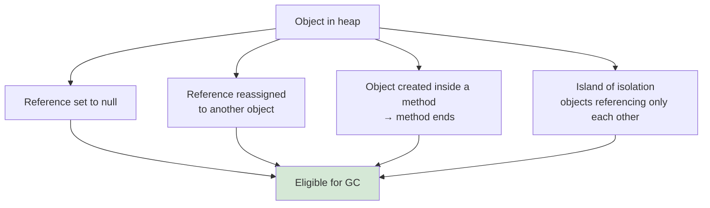
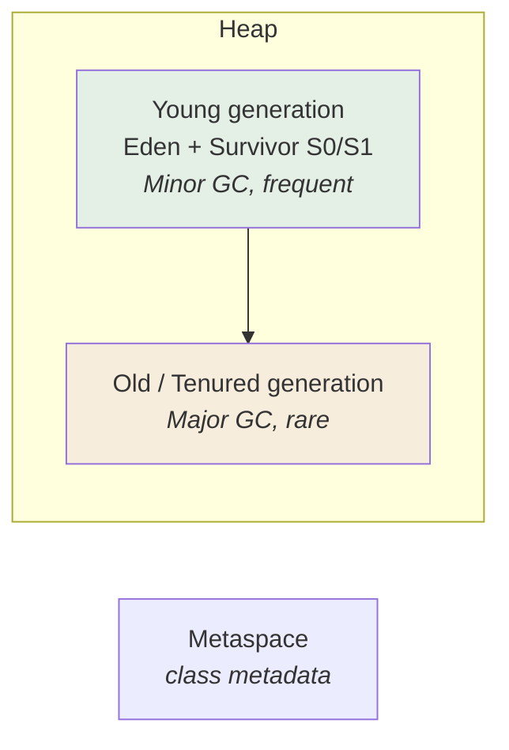

  

---

> **In one line:** The JVM automatically reclaims heap memory occupied by objects that are no longer referenced.

## 1. What Is It?

**Garbage collection** is the automatic process by which the JVM finds objects that are no longer used and frees the **heap** memory they occupy. In languages like C the programmer must free memory manually; in Java the **Garbage Collector**, a daemon thread, does it.

## 2. When Does An Object Become Eligible?

## 3. Heap Generations

New objects are born in the **Young** generation. Objects that survive several collections are promoted to the **Old** generation.

## 4. Requesting Collection

| Call | Effect |
|---|---|
| `System.gc()` | **Requests** collection — the JVM may ignore it |
| `Runtime.getRuntime().gc()` | Same request, different entry point |
| `finalize()` | Called before an object is collected; deprecated and unreliable |

## 5. Important Rules

- Garbage collection is **never guaranteed** at a specific moment.
- It cleans the **heap only** — never the stack.
- A memory leak in Java means keeping unwanted references alive, not failing to free memory.

## 6. Best Practices

- Set long-lived references to `null` when they are genuinely finished.
- Close streams, connections and resources explicitly instead of relying on the collector.

## 7. In Depth

Garbage collection is based on **reachability**, not on reference counting. Starting from a set of GC roots — active stack frames, static fields, JNI references — the collector marks everything reachable; whatever is left is garbage. This is why two objects referencing only each other are still collected, a case reference counting would leak.

The heap is divided by generation because of the **weak generational hypothesis**: most objects die young. A minor collection scans only the small young generation and is therefore fast, copying the few survivors rather than touching the many dead objects. Objects that survive repeated collections are promoted to the old generation, which is collected far less often.

**Stop-the-world pauses** are the practical concern. Some phases must suspend application threads, and pause length rather than total CPU cost is what users notice. Collector choice is a trade-off:

| Collector | Optimises for |
|---|---|
| Serial | Small heaps, single core |
| Parallel | Maximum throughput |
| G1 (default) | Balanced, predictable pause targets |
| ZGC / Shenandoah | Very large heaps with pauses of a few milliseconds |

**Memory leaks still happen in Java**, because the collector cannot know that a reachable object is no longer wanted. The usual causes are static collections that only grow, listeners that are registered and never removed, and cached objects with no eviction policy.

`finalize()` was deprecated because it ran unpredictably and could resurrect objects; `try-with-resources` and `Cleaner` are the correct replacements. `System.gc()` is only a request and is normally best left alone.

## 8. Quick Revision

> Unreferenced heap objects → eligible → collected by a daemon thread. `System.gc()` only requests, never forces.

---

<a href="01-Generics.md">← Generics</a> &nbsp;•&nbsp; <a href="../README.md">Home</a> &nbsp;•&nbsp; <a href="03-Reflection-API.md">Reflection API →</a>

Core Java Theory Notes • Maintained by <b>Kundan</b>

