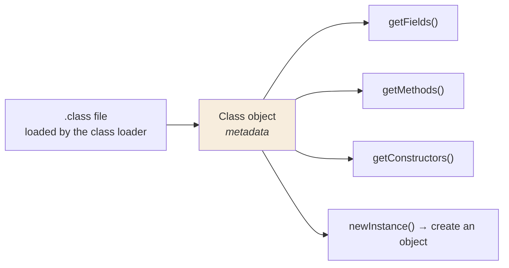

<div align="center">


  

</div>

---

> **In one line:** Inspecting and manipulating classes, methods and fields at runtime.

## 1. What Is It?

The **Reflection API** lets a program inspect and modify classes, interfaces, constructors, methods and fields **at runtime**, even without knowing their names at compile time. It lives in the `java.lang.reflect` package.

## 2. How It Works



## 3. Three Ways To Reach The Class Object

```java
Class<?> c1 = obj.getClass();
Class<?> c2 = Student.class;
Class<?> c3 = Class.forName("com.kundan.Student");
```

## 4. What Reflection Can Do

| Capability | Method family |
|---|---|
| List methods | `getMethods()`, `getDeclaredMethods()` |
| List fields | `getFields()`, `getDeclaredFields()` |
| List constructors | `getConstructors()` |
| Create objects | `getDeclaredConstructor().newInstance()` |
| Call a method by name | `invoke()` |
| Access private members | `setAccessible(true)` |

## 5. Where It Is Used

Frameworks rely on reflection constantly: **Spring** for dependency injection, **Hibernate** for mapping fields to columns, **JUnit** for finding test methods, and IDEs for auto-completion.

## 6. Drawbacks

- **Slower** than direct calls because checks happen at runtime.
- **Breaks encapsulation** by reaching private members.
- Errors surface at runtime instead of compile time, and refactoring can silently break name-based lookups.

## 7. In Depth

Reflection is possible because a compiled class keeps its full metadata — field names, method signatures and annotations — in the `.class` file. Most compiled languages discard that information, which is why this style of framework is far more common in Java than in C or C++.

It is the mechanism behind almost every framework a Java developer uses: Spring scans classes for annotations and injects dependencies; Hibernate maps fields to columns; Jackson converts objects to JSON by inspecting properties; JUnit finds and invokes test methods; and application servers load classes named only in a configuration file.

The costs are real and worth stating plainly:

- **Performance.** A reflective call skips JIT optimisations such as inlining and performs access checks at runtime. Caching the `Method` or `Field` object removes the lookup cost but not the invocation cost.
- **Safety.** Errors that would normally be compile errors become runtime exceptions, and a rename that an IDE would handle automatically silently breaks a name used as a string.
- **Encapsulation.** `setAccessible(true)` can reach private members, which is why the module system now restricts deep reflection into JDK internals unless a module explicitly `opens` a package.

Modern alternatives narrow the need: `MethodHandles` and `VarHandle` are faster, and annotation processing generates code at compile time instead of inspecting it at runtime.

## 8. Quick Revision

> Reflection = read and use class metadata at runtime. It powers frameworks, but it is slow and bypasses encapsulation.

---

<div align="center">

<a href="02-Garbage-Collection.md">← Garbage Collection</a> &nbsp;•&nbsp; <a href="../README.md">Home</a> &nbsp;•&nbsp; <a href="04-Inner-Classes.md">Inner Classes →</a>


<sub>Core Java Theory Notes • Maintained by <b>Kundan</b></sub>

</div>
