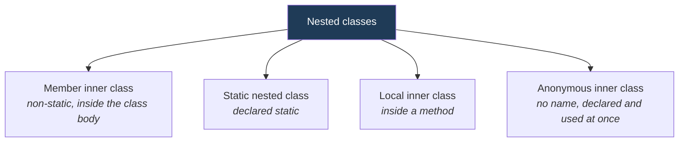

<div align="center">


  

</div>

---

> **In one line:** A class declared inside another class, used to logically group code that is used in only one place.

## 1. What Is It?

An **inner class** is a class defined inside another class. It is used when a class is meaningful only in the context of its outer class, and it can access the outer class members — including `private` ones.

## 2. Four Types



## 3. Comparison

| Type | Declared | Needs an outer object? | Can access outer instance members? |
|---|---|---|---|
| **Member inner** | Inside the class body | Yes | Yes |
| **Static nested** | Inside the class body with `static` | No | Only static members |
| **Local inner** | Inside a method or block | Yes | Yes, plus effectively final local variables |
| **Anonymous** | At the point of use | Depends | Yes |

## 4. Syntax

```java
class Outer {
    class Inner { }                 // member inner
    static class Nested { }         // static nested
    void show() {
        class Local { }             // local inner
    }
}
```

An **anonymous** inner class implements an interface or extends a class on the spot:

```java
Runnable r = new Runnable() {
    public void run() { }
};
```

## 5. Advantages

- Groups classes that are used only in one place, improving readability.
- Gives access to the outer class's private data.
- Anonymous classes make short event handlers and callbacks concise.

## 6. Important Rules

- A member inner class is created as `outer.new Inner()`.
- A static nested class is created as `new Outer.Nested()`.
- An anonymous class cannot have a constructor, because it has no name.
- From Java 8, a **lambda expression** replaces most anonymous classes that implement a functional interface.

## 7. In Depth

The compiler implements inner classes by generating separate class files named `Outer$Inner.class`, and that translation explains most of their behaviour.

A **non-static inner class** receives a hidden reference to its enclosing instance, which is how it reaches the outer object's fields. That hidden reference is also a well-known source of memory leaks: as long as the inner object is alive, the outer object cannot be collected. A long-lived listener or a non-static `Runnable` holding an entire enclosing component alive is the usual symptom. The fix is almost always to make the nested class `static` unless it genuinely needs the enclosing instance.

A **local class** can capture local variables only if they are `final` or effectively final, because the value is copied into the generated class at creation time; allowing reassignment would make the copy and the original diverge.

An **anonymous class** is a compact way to implement a one-off interface. Java 8 lambdas replace most of them, but not all: a lambda can only implement a functional interface, cannot hold state, and binds `this` to the enclosing instance, whereas an anonymous class creates a new `this` of its own.

Each form has its place: static nested classes for helper types such as a `Node` inside a linked list or a builder inside its product; inner classes for types that are meaningless without their enclosing object, such as an iterator over a collection.

## 8. Quick Revision

> Member (needs outer object) • Static nested (does not) • Local (inside a method) • Anonymous (nameless, one-time use).

---

<div align="center">

<a href="03-Reflection-API.md">← Reflection API</a> &nbsp;•&nbsp; <a href="../README.md">Home</a> &nbsp;•&nbsp; <a href="../12-Java-8-Features/README.md">Java 8 Features →</a>


<sub>Core Java Theory Notes • Maintained by <b>Kundan</b></sub>

</div>
