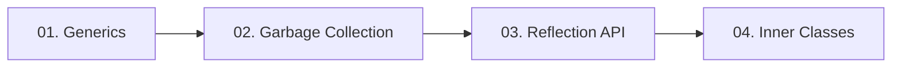

  

---

> Type safety with generics, automatic memory cleanup, runtime inspection with reflection, and classes declared inside classes.

## Topics In This Chapter

| # | Topic | What you will learn |
|---|---|---|
| 01 | [Generics](./01-Generics.md) | Type-safe classes, interfaces and methods with type parameters |
| 02 | [Garbage Collection](./02-Garbage-Collection.md) | How unused objects are detected and removed from the heap |
| 03 | [Reflection API](./03-Reflection-API.md) | Examining and using class metadata while the program runs |
| 04 | [Inner Classes](./04-Inner-Classes.md) | Member, static nested, local and anonymous inner classes |

## Learning Path

---

<a href="../10-File-Handling/README.md">← Serialization and De-Serialization</a> &nbsp;•&nbsp; <a href="../README.md">Home</a> &nbsp;•&nbsp; <a href="../12-Java-8-Features/README.md">Java 8 Features →</a>

Core Java Theory Notes • Maintained by <b>Kundan</b>

