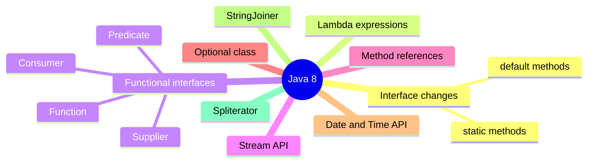

  

---

> **In one line:** Java 8 introduced functional programming to simplify code and make it more readable.

## 1. What Is It?

Java 8 introduced a large set of new features that **changed the coding style** of the language.

## 2. Main Aims Of Java 8

- To **simplify programming**
- To enable **functional programming**
- To write more **readable and concise** code

## 3. Feature Map

## 4. Feature Summary

| Feature | What it gives you |
|---|---|
| **Interface changes** | `default` and `static` methods inside interfaces |
| **Lambda expressions** | Functions written as short expressions |
| **Functional interfaces** | Single-abstract-method types that lambdas plug into |
| **Stream API** | Declarative processing of collections |
| **Method references** | An even shorter form of a lambda |
| **Optional** | A container that removes most `NullPointerException` risk |
| **Date & Time API** | An immutable, thread-safe replacement for `Date` and `Calendar` |
| **StringJoiner** | Joins strings with a delimiter, prefix and suffix |
| **Spliterator** | An iterator that supports splitting for parallel work |

## 5. In Depth

Java 8 was driven by hardware rather than fashion. Processors had stopped getting faster and started gaining cores, so libraries needed a way to parallelise work without every developer writing thread code. Doing that requires the library to control iteration — and that requires the ability to pass **behaviour** into the library.

This is why the features form one connected chain rather than a list. Lambdas give a concise way to write behaviour; functional interfaces give lambdas a type; `default` methods allow new methods such as `stream()` to be added to existing interfaces without breaking the thousands of classes already implementing them; and the Stream API uses all three to express a pipeline that can be executed sequentially or in parallel by changing a single method call.

The shift is from **external iteration**, where the program writes the loop and controls each step, to **internal iteration**, where the program says what should happen to each element and the library decides how to traverse, when to short-circuit and whether to split the work.

Java 8 also fixed one long-standing wart: the mutable, poorly designed `Date` and `Calendar` classes were replaced by the immutable `java.time` API. Functional style in Java remains optional — an imperative loop is still perfectly good code, and is often clearer for simple work.

## 6. Quick Revision

> Java 8 = functional programming for Java: lambdas + functional interfaces + streams, with interfaces finally allowed to carry code.

---

<a href="../11-Advanced-Concepts/04-Inner-Classes.md">← Inner Classes</a> &nbsp;•&nbsp; <a href="../README.md">Home</a> &nbsp;•&nbsp; <a href="02-Interface-Changes.md">Interface Changes →</a>

Core Java Theory Notes • Maintained by <b>Kundan</b>

