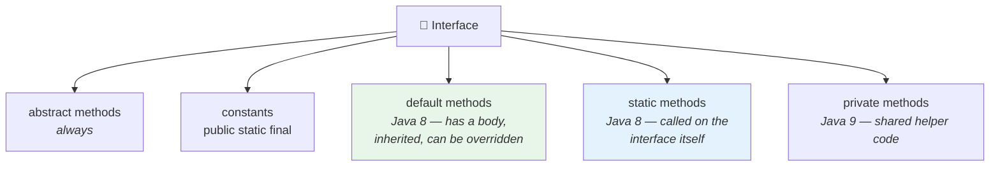

<div align="center">


  

</div>

---

> **In one line:** From Java 8 an interface can carry default and static methods with real bodies.

## 🧠 1. What Is It?

Before Java 8 an interface could hold only abstract methods and constants. Adding a new method to a published interface **broke every implementing class**. Java 8 fixed this with two new kinds of interface methods.

## 🧩 2. Interface Members By Version



## 🧾 3. Syntax

```java
interface Vehicle {
    void start();                                  // abstract
    default void horn() { }                        // default
    static int wheels() { return 4; }              // static
}
```

## 📋 4. default vs static

| | `default` method | `static` method |
|---|---|---|
| Inherited by implementing classes | ✅ Yes | ❌ No |
| Can be overridden | ✅ Yes | ❌ No |
| Called using | An object reference | The interface name |
| Purpose | Add behaviour without breaking existing code | Utility helpers tied to the interface |

## ⚠️ 5. The Diamond Problem

If a class implements two interfaces that both provide the same `default` method, the compiler forces the class to **override it** and choose, using `InterfaceName.super.method()`.

## 📌 6. Important Rules

- An interface with `default` methods is still an interface — it cannot hold state.
- A class inheriting a class method and an interface `default` method always prefers the **class** method.

## 🔁 7. Quick Revision

> `default` = inherited body that can be overridden; `static` = interface-level utility. Both keep old code from breaking.

---

<div align="center">

<a href="01-Java-8-Introduction.md">⬅️ Java 8 Introduction</a> &nbsp;•&nbsp; <a href="../README.md">🏠 Home</a> &nbsp;•&nbsp; <a href="03-Lambda-Expressions.md">Lambda Expressions ➡️</a>


<sub>📘 Core Java Theory Notes • Maintained by <b>Kundan</b></sub>

</div>
