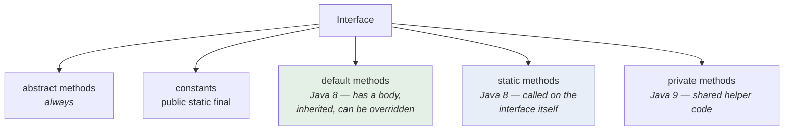

<div align="center">


  

</div>

---

> **In one line:** From Java 8 an interface can carry default and static methods with real bodies.

## 1. What Is It?

Before Java 8 an interface could hold only abstract methods and constants. Adding a new method to a published interface **broke every implementing class**. Java 8 fixed this with two new kinds of interface methods.

## 2. Interface Members By Version



## 3. Syntax

```java
interface Vehicle {
    void start();                                  // abstract
    default void horn() { }                        // default
    static int wheels() { return 4; }              // static
}
```

## 4. default vs static

| | `default` method | `static` method |
|---|---|---|
| Inherited by implementing classes | Yes | No |
| Can be overridden | Yes | No |
| Called using | An object reference | The interface name |
| Purpose | Add behaviour without breaking existing code | Utility helpers tied to the interface |

## 5. The Diamond Problem

If a class implements two interfaces that both provide the same `default` method, the compiler forces the class to **override it** and choose, using `InterfaceName.super.method()`.

## 6. Important Rules

- An interface with `default` methods is still an interface — it cannot hold state.
- A class inheriting a class method and an interface `default` method always prefers the **class** method.

## 7. In Depth

The real motivation for `default` methods was **interface evolution**. Adding `stream()` to `Collection` would have broken every class in the world implementing it, and the Stream API would have been impossible without it. A default implementation lets an interface grow while existing implementations keep compiling unchanged.

The cost is a new ambiguity, and the resolution rules are precise:

1. A method declared in a **class** always wins over any interface default.
2. Otherwise, the **most specific interface** wins — a sub-interface beats the interface it extends.
3. If two unrelated interfaces both supply the method, the class **must** override it, and can delegate explicitly using `InterfaceName.super.method()`.

Rule 1 is what prevents a default method from silently changing behaviour a class already inherits.

Interfaces still cannot hold **state**, which is the essential difference from abstract classes and the reason the diamond problem does not fully return. Default methods can only compute from other interface methods.

`static` interface methods keep factory and helper methods next to the type they belong to — `Comparator.comparing()` and `List.of()` are examples — replacing the old convention of a separate `Collections`-style utility class. Java 9 added `private` interface methods so that several default methods can share helper logic without exposing it.

## 8. Quick Revision

> `default` = inherited body that can be overridden; `static` = interface-level utility. Both keep old code from breaking.

---

<div align="center">

<a href="01-Java-8-Introduction.md">← Java 8 Introduction</a> &nbsp;•&nbsp; <a href="../README.md">Home</a> &nbsp;•&nbsp; <a href="03-Lambda-Expressions.md">Lambda Expressions →</a>


<sub>Core Java Theory Notes • Maintained by <b>Kundan</b></sub>

</div>
