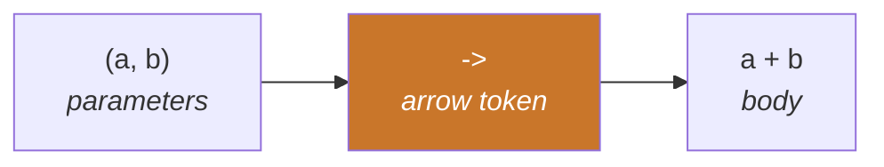
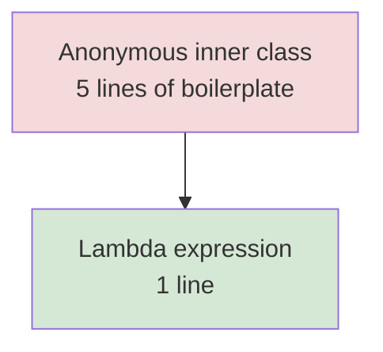

<div align="center">


  

</div>

---

> **In one line:** An anonymous function written as a short expression that can be passed around like data.

## 1. What Is It?

A **lambda expression** is an anonymous function — a block of code with parameters and a body, but **no name, no return type and no access modifier**. It exists to give a short implementation for a **functional interface**.

## 2. Anatomy



## 3. Syntax Forms

```java
() -> System.out.println("Hi");     // no parameter
(x) -> x * x;                       // one parameter
x -> x * x;                         // parentheses optional
(a, b) -> a + b;                    // multiple parameters
(a, b) -> { return a + b; }         // block body needs return
```

## 4. Before And After



## 5. Important Rules

- A lambda can be used **only** with a functional interface — one abstract method.
- Parameter types are usually **inferred**, so they can be omitted.
- Braces and `return` are required only for a multi-statement body.
- A lambda can read **effectively final** local variables from the enclosing scope.
- Inside a lambda, `this` refers to the **enclosing class**, not to the lambda.

## 6. Advantages

- Far less boilerplate than anonymous inner classes.
- Behaviour can be passed as an argument.
- Enables the Stream API and parallel processing.

## 7. In Depth

A lambda is **not** an anonymous class in disguise. The compiler does not generate an extra class file; it emits an `invokedynamic` instruction, and the JVM builds the implementation at runtime through `LambdaMetafactory`. Stateless lambdas can therefore be created once and reused, which makes them lighter than anonymous classes in both class count and allocation.

**Variable capture** follows one rule: a lambda may read local variables that are `final` or **effectively final**. The value is captured, not the variable, which is why reassigning it afterwards would be meaningless and is rejected. Instance and static fields can be modified freely, because the lambda captures `this` rather than the field itself.

**`this` means the enclosing instance**, unlike in an anonymous class where `this` refers to the anonymous object. Lambdas are said to be lexically scoped: they introduce no new scope at all, so a lambda cannot declare a variable that shadows one from the enclosing method.

Lambdas should stay short. A lambda that grows past a few lines is better extracted into a named method and referenced with `::`, which restores a meaningful name and makes the code testable. They should also avoid side effects, particularly inside streams, because a lambda that mutates shared state breaks the moment the stream runs in parallel.

## 8. Quick Revision

> `(parameters) -> body`. A lambda is an implementation of a functional interface, written inline.

---

<div align="center">

<a href="02-Interface-Changes.md">← Interface Changes</a> &nbsp;•&nbsp; <a href="../README.md">Home</a> &nbsp;•&nbsp; <a href="04-Functional-Interfaces.md">Functional Interfaces →</a>


<sub>Core Java Theory Notes • Maintained by <b>Kundan</b></sub>

</div>
