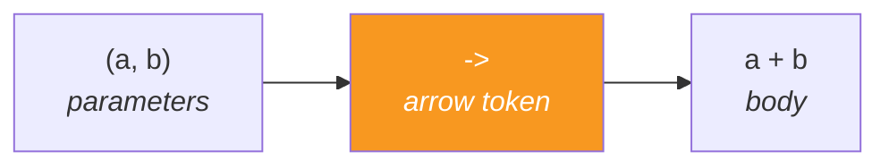
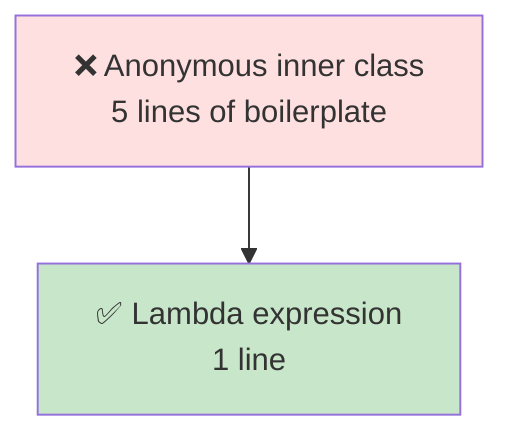

<div align="center">


  

</div>

---

> **In one line:** An anonymous function written as a short expression that can be passed around like data.

## 🧠 1. What Is It?

A **lambda expression** is an anonymous function — a block of code with parameters and a body, but **no name, no return type and no access modifier**. It exists to give a short implementation for a **functional interface**.

## 🧩 2. Anatomy



## 🧾 3. Syntax Forms

```java
() -> System.out.println("Hi");     // no parameter
(x) -> x * x;                       // one parameter
x -> x * x;                         // parentheses optional
(a, b) -> a + b;                    // multiple parameters
(a, b) -> { return a + b; }         // block body needs return
```

## ⚖️ 4. Before And After



## 📌 5. Important Rules

- A lambda can be used **only** with a functional interface — one abstract method.
- Parameter types are usually **inferred**, so they can be omitted.
- Braces and `return` are required only for a multi-statement body.
- A lambda can read **effectively final** local variables from the enclosing scope.
- Inside a lambda, `this` refers to the **enclosing class**, not to the lambda.

## ✅ 6. Advantages

- Far less boilerplate than anonymous inner classes.
- Behaviour can be passed as an argument.
- Enables the Stream API and parallel processing.

## 🔁 7. Quick Revision

> `(parameters) -> body`. A lambda is an implementation of a functional interface, written inline.

---

<div align="center">

<a href="02-Interface-Changes.md">⬅️ Interface Changes</a> &nbsp;•&nbsp; <a href="../README.md">🏠 Home</a> &nbsp;•&nbsp; <a href="04-Functional-Interfaces.md">Functional Interfaces ➡️</a>


<sub>📘 Core Java Theory Notes • Maintained by <b>Kundan</b></sub>

</div>
